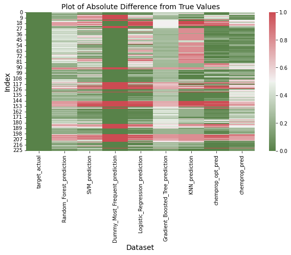
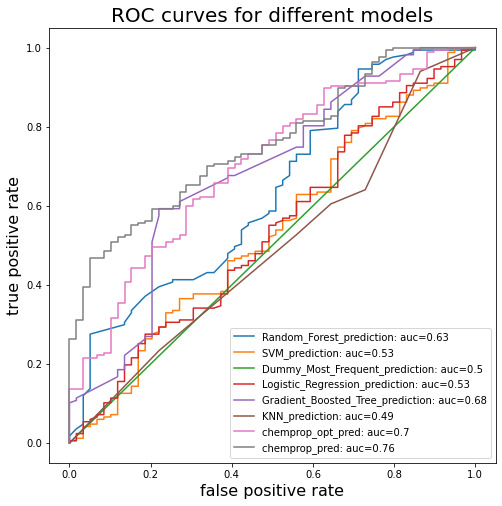
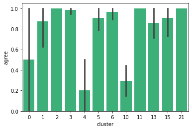
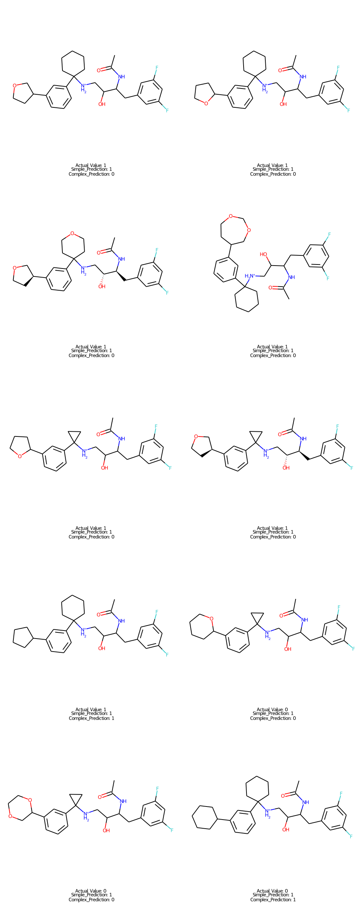
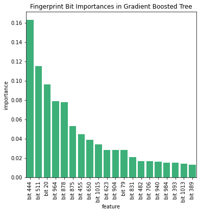
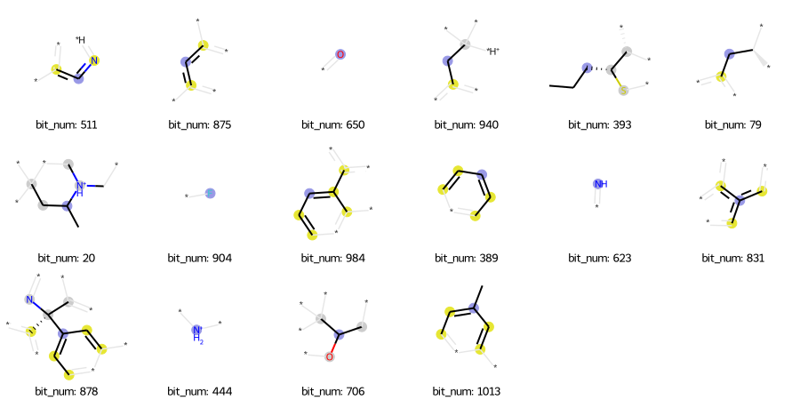

---
title: Bace Eval
theme: slate
filename: Bace_Eval.md
--- 


```python
import altair as alt
import seaborn as sns
import pandas as pd
import matplotlib.pyplot as plt
from sklearn.metrics import roc_auc_score
from sklearn.metrics import accuracy_score
from sklearn.metrics import f1_score
from sklearn.metrics import log_loss
from sklearn.metrics import matthews_corrcoef
from sklearn.metrics import roc_curve
import pickle
from rdkit.Chem import PandasTools
import numpy as np
```


```python
# ID top model 
#Goals - compare model predictions
# Visualize a few molecules that were right/wrong
# Pick a best Simple model to compare 

```


```python
df_chemprop=pd.read_csv('Complex_Models/Predictions/bace-cluster-validate-pred.csv')
df_chemprop=df_chemprop[['mol','cluster','active','target_actual']]
df_chemprop.rename(columns={'active':'chemprop_pred'},inplace=True)
df_chemprop.head(10)
```


<div>
<style scoped>
    .dataframe tbody tr th:only-of-type {
        vertical-align: middle;
    }

    .dataframe tbody tr th {
        vertical-align: top;
    }

    .dataframe thead th {
        text-align: right;
    }
</style>
<table border="1" class="dataframe">
  <thead>
    <tr style="text-align: right;">
      <th></th>
      <th>mol</th>
      <th>cluster</th>
      <th>chemprop_pred</th>
      <th>target_actual</th>
    </tr>
  </thead>
  <tbody>
    <tr>
      <th>0</th>
      <td>Clc1cc2CC([NH+]=C(N[C@@H](C[C@H]3[C@H](SC=C3c3...</td>
      <td>0</td>
      <td>0.728779</td>
      <td>1</td>
    </tr>
    <tr>
      <th>1</th>
      <td>Brc1cscc1C[C@H](NC1=[NH+]C(Cc2c1ccc(Cl)c2)(C)C...</td>
      <td>0</td>
      <td>0.518657</td>
      <td>1</td>
    </tr>
    <tr>
      <th>2</th>
      <td>Clc1cc2CC([NH+]=C(N[C@@H](Cc3cscc3-c3cn[nH]c3)...</td>
      <td>0</td>
      <td>0.896534</td>
      <td>1</td>
    </tr>
    <tr>
      <th>3</th>
      <td>Clc1cc2CC([NH+]=C(N[C@@H](Cc3cscc3CCC)C(=O)[O-...</td>
      <td>0</td>
      <td>0.482375</td>
      <td>1</td>
    </tr>
    <tr>
      <th>4</th>
      <td>S1(=O)(=O)NCC2(N1c1cc(F)ccc1)CC([NH+](CC2)Cc1c...</td>
      <td>1</td>
      <td>0.064917</td>
      <td>0</td>
    </tr>
    <tr>
      <th>5</th>
      <td>Clc1ccccc1-c1cc(ccc1)C[NH+]1CCC2(N(S(=O)(=O)NC...</td>
      <td>1</td>
      <td>0.085788</td>
      <td>0</td>
    </tr>
    <tr>
      <th>6</th>
      <td>S1(=O)(=O)NCC2(N1c1cc(F)ccc1)CC([NH+](CC2)Cc1c...</td>
      <td>1</td>
      <td>0.052448</td>
      <td>0</td>
    </tr>
    <tr>
      <th>7</th>
      <td>S1(=O)(=O)NCC2(N1c1cc(F)ccc1)CC([NH+](CC2)Cc1c...</td>
      <td>1</td>
      <td>0.183020</td>
      <td>0</td>
    </tr>
    <tr>
      <th>8</th>
      <td>S1(=O)(=O)NCC2(N1c1cc(F)ccc1)CC([NH+](CC2)Cc1c...</td>
      <td>1</td>
      <td>0.081907</td>
      <td>0</td>
    </tr>
    <tr>
      <th>9</th>
      <td>S1(=O)(=O)NCC2(N1c1cc(F)ccc1)CC([NH+](CC2)Cc1c...</td>
      <td>1</td>
      <td>0.035316</td>
      <td>0</td>
    </tr>
  </tbody>
</table>
</div>


```python
df_chemprop_opt=pd.read_csv('Complex_Models/Predictions/bace-cluster-validate-pred-hyperopt.csv')
```


```python
df_chemprop_opt=df_chemprop_opt[['mol','cluster','active','target_actual']]
df_chemprop_opt.rename(columns={'active':'chemprop_opt_pred'},inplace=True)
df_chemprop_opt.head(10)
```


<div>
<style scoped>
    .dataframe tbody tr th:only-of-type {
        vertical-align: middle;
    }

    .dataframe tbody tr th {
        vertical-align: top;
    }

    .dataframe thead th {
        text-align: right;
    }
</style>
<table border="1" class="dataframe">
  <thead>
    <tr style="text-align: right;">
      <th></th>
      <th>mol</th>
      <th>cluster</th>
      <th>chemprop_opt_pred</th>
      <th>target_actual</th>
    </tr>
  </thead>
  <tbody>
    <tr>
      <th>0</th>
      <td>Clc1cc2CC([NH+]=C(N[C@@H](C[C@H]3[C@H](SC=C3c3...</td>
      <td>0</td>
      <td>0.999946</td>
      <td>1</td>
    </tr>
    <tr>
      <th>1</th>
      <td>Brc1cscc1C[C@H](NC1=[NH+]C(Cc2c1ccc(Cl)c2)(C)C...</td>
      <td>0</td>
      <td>0.973137</td>
      <td>1</td>
    </tr>
    <tr>
      <th>2</th>
      <td>Clc1cc2CC([NH+]=C(N[C@@H](Cc3cscc3-c3cn[nH]c3)...</td>
      <td>0</td>
      <td>0.999860</td>
      <td>1</td>
    </tr>
    <tr>
      <th>3</th>
      <td>Clc1cc2CC([NH+]=C(N[C@@H](Cc3cscc3CCC)C(=O)[O-...</td>
      <td>0</td>
      <td>0.999404</td>
      <td>1</td>
    </tr>
    <tr>
      <th>4</th>
      <td>S1(=O)(=O)NCC2(N1c1cc(F)ccc1)CC([NH+](CC2)Cc1c...</td>
      <td>1</td>
      <td>0.364498</td>
      <td>0</td>
    </tr>
    <tr>
      <th>5</th>
      <td>Clc1ccccc1-c1cc(ccc1)C[NH+]1CCC2(N(S(=O)(=O)NC...</td>
      <td>1</td>
      <td>0.421441</td>
      <td>0</td>
    </tr>
    <tr>
      <th>6</th>
      <td>S1(=O)(=O)NCC2(N1c1cc(F)ccc1)CC([NH+](CC2)Cc1c...</td>
      <td>1</td>
      <td>0.451310</td>
      <td>0</td>
    </tr>
    <tr>
      <th>7</th>
      <td>S1(=O)(=O)NCC2(N1c1cc(F)ccc1)CC([NH+](CC2)Cc1c...</td>
      <td>1</td>
      <td>0.710904</td>
      <td>0</td>
    </tr>
    <tr>
      <th>8</th>
      <td>S1(=O)(=O)NCC2(N1c1cc(F)ccc1)CC([NH+](CC2)Cc1c...</td>
      <td>1</td>
      <td>0.468126</td>
      <td>0</td>
    </tr>
    <tr>
      <th>9</th>
      <td>S1(=O)(=O)NCC2(N1c1cc(F)ccc1)CC([NH+](CC2)Cc1c...</td>
      <td>1</td>
      <td>0.344102</td>
      <td>0</td>
    </tr>
  </tbody>
</table>
</div>


```python
df=pd.read_csv('Simple_Models/Predictions/bace-cluster-validate-pred.csv')
df=df[['mol','cluster','target_actual','Random_Forest_prediction','SVM_prediction','Dummy_Most_Frequent_prediction',
      'Logistic_Regression_prediction','Gradient_Boosted_Tree_prediction','KNN_prediction']]
```


```python
df.head(5)
```


<div>
<style scoped>
    .dataframe tbody tr th:only-of-type {
        vertical-align: middle;
    }

    .dataframe tbody tr th {
        vertical-align: top;
    }

    .dataframe thead th {
        text-align: right;
    }
</style>
<table border="1" class="dataframe">
  <thead>
    <tr style="text-align: right;">
      <th></th>
      <th>mol</th>
      <th>cluster</th>
      <th>target_actual</th>
      <th>Random_Forest_prediction</th>
      <th>SVM_prediction</th>
      <th>Dummy_Most_Frequent_prediction</th>
      <th>Logistic_Regression_prediction</th>
      <th>Gradient_Boosted_Tree_prediction</th>
      <th>KNN_prediction</th>
    </tr>
  </thead>
  <tbody>
    <tr>
      <th>0</th>
      <td>Clc1cc2CC([NH+]=C(N[C@@H](C[C@H]3[C@H](SC=C3c3...</td>
      <td>0</td>
      <td>1</td>
      <td>0.57</td>
      <td>0.819070</td>
      <td>1.0</td>
      <td>0.916904</td>
      <td>0.738439</td>
      <td>0.8</td>
    </tr>
    <tr>
      <th>1</th>
      <td>Brc1cscc1C[C@H](NC1=[NH+]C(Cc2c1ccc(Cl)c2)(C)C...</td>
      <td>0</td>
      <td>1</td>
      <td>0.79</td>
      <td>0.905181</td>
      <td>1.0</td>
      <td>0.917695</td>
      <td>0.546623</td>
      <td>0.6</td>
    </tr>
    <tr>
      <th>2</th>
      <td>Clc1cc2CC([NH+]=C(N[C@@H](Cc3cscc3-c3cn[nH]c3)...</td>
      <td>0</td>
      <td>1</td>
      <td>0.69</td>
      <td>0.827985</td>
      <td>1.0</td>
      <td>0.932879</td>
      <td>0.722030</td>
      <td>0.4</td>
    </tr>
    <tr>
      <th>3</th>
      <td>Clc1cc2CC([NH+]=C(N[C@@H](Cc3cscc3CCC)C(=O)[O-...</td>
      <td>0</td>
      <td>1</td>
      <td>0.82</td>
      <td>0.913416</td>
      <td>1.0</td>
      <td>0.979885</td>
      <td>0.546623</td>
      <td>0.8</td>
    </tr>
    <tr>
      <th>4</th>
      <td>S1(=O)(=O)NCC2(N1c1cc(F)ccc1)CC([NH+](CC2)Cc1c...</td>
      <td>1</td>
      <td>0</td>
      <td>0.12</td>
      <td>0.862242</td>
      <td>1.0</td>
      <td>0.415542</td>
      <td>0.229203</td>
      <td>0.0</td>
    </tr>
  </tbody>
</table>
</div>


```python
print(df.shape)
df=df.merge(df_chemprop_opt[['mol','chemprop_opt_pred']],on='mol',how='outer')
print(df.shape)
df=df.merge(df_chemprop[['mol','chemprop_pred']],on='mol',how='outer')
print(df.shape)
```

    (226, 9)
    (226, 10)
    (226, 11)


```python
df.head(5)
```


<div>
<style scoped>
    .dataframe tbody tr th:only-of-type {
        vertical-align: middle;
    }

    .dataframe tbody tr th {
        vertical-align: top;
    }

    .dataframe thead th {
        text-align: right;
    }
</style>
<table border="1" class="dataframe">
  <thead>
    <tr style="text-align: right;">
      <th></th>
      <th>mol</th>
      <th>cluster</th>
      <th>target_actual</th>
      <th>Random_Forest_prediction</th>
      <th>SVM_prediction</th>
      <th>Dummy_Most_Frequent_prediction</th>
      <th>Logistic_Regression_prediction</th>
      <th>Gradient_Boosted_Tree_prediction</th>
      <th>KNN_prediction</th>
      <th>chemprop_opt_pred</th>
      <th>chemprop_pred</th>
    </tr>
  </thead>
  <tbody>
    <tr>
      <th>0</th>
      <td>Clc1cc2CC([NH+]=C(N[C@@H](C[C@H]3[C@H](SC=C3c3...</td>
      <td>0</td>
      <td>1</td>
      <td>0.57</td>
      <td>0.819070</td>
      <td>1.0</td>
      <td>0.916904</td>
      <td>0.738439</td>
      <td>0.8</td>
      <td>0.999946</td>
      <td>0.728779</td>
    </tr>
    <tr>
      <th>1</th>
      <td>Brc1cscc1C[C@H](NC1=[NH+]C(Cc2c1ccc(Cl)c2)(C)C...</td>
      <td>0</td>
      <td>1</td>
      <td>0.79</td>
      <td>0.905181</td>
      <td>1.0</td>
      <td>0.917695</td>
      <td>0.546623</td>
      <td>0.6</td>
      <td>0.973137</td>
      <td>0.518657</td>
    </tr>
    <tr>
      <th>2</th>
      <td>Clc1cc2CC([NH+]=C(N[C@@H](Cc3cscc3-c3cn[nH]c3)...</td>
      <td>0</td>
      <td>1</td>
      <td>0.69</td>
      <td>0.827985</td>
      <td>1.0</td>
      <td>0.932879</td>
      <td>0.722030</td>
      <td>0.4</td>
      <td>0.999860</td>
      <td>0.896534</td>
    </tr>
    <tr>
      <th>3</th>
      <td>Clc1cc2CC([NH+]=C(N[C@@H](Cc3cscc3CCC)C(=O)[O-...</td>
      <td>0</td>
      <td>1</td>
      <td>0.82</td>
      <td>0.913416</td>
      <td>1.0</td>
      <td>0.979885</td>
      <td>0.546623</td>
      <td>0.8</td>
      <td>0.999404</td>
      <td>0.482375</td>
    </tr>
    <tr>
      <th>4</th>
      <td>S1(=O)(=O)NCC2(N1c1cc(F)ccc1)CC([NH+](CC2)Cc1c...</td>
      <td>1</td>
      <td>0</td>
      <td>0.12</td>
      <td>0.862242</td>
      <td>1.0</td>
      <td>0.415542</td>
      <td>0.229203</td>
      <td>0.0</td>
      <td>0.364498</td>
      <td>0.064917</td>
    </tr>
  </tbody>
</table>
</div>


```python

#df_heatmap.columns
```


```python
heatmap_cols=[i for i in list(df.columns) if i not in ['mol','cluster']]
df_heatmap=df[heatmap_cols].copy()
actual_values=df_heatmap['target_actual']
for col in df_heatmap.columns:
    df_heatmap[col]=abs(df_heatmap[col]-actual_values)

fig,axes=plt.subplots(1,figsize=(10,5))
cmap=sns.diverging_palette(120, 370, s=60, as_cmap=True)
plot=sns.heatmap(data=df_heatmap,ax=axes,cmap=cmap)
plot.set_xlabel('Dataset',fontsize=14)
plot.set_ylabel('Index',fontsize=14)
plot.set_title('Plot of Absolute Difference from True Values',fontsize=14)
plot.legend
```


    <bound method Axes.legend of <AxesSubplot:title={'center':'Plot of Absolute Difference from True Values'}, xlabel='Dataset', ylabel='Index'>>


    

    


```python
df['target_actual'].value_counts()
```


    1    167
    0     59
    Name: target_actual, dtype: int64


```python
pred_cols=[i for i in list(df.columns) if i not in ['mol','cluster','target_actual']]
```


```python
# code inspired by: https://stackoverflow.com/questions/25009284/how-to-plot-roc-curve-in-python
def roc_plot(): 
    pred_cols=[i for i in list(df.columns) if i not in ['mol','cluster','target_actual']]
    plt.figure(figsize=(8,8))
    for col in pred_cols:
        fpr, tpr, _ = roc_curve(df['target_actual'],  df[col])
        auc = roc_auc_score(df['target_actual'], df[col]).round(2)
        plt.plot(fpr,tpr,label=f"{col}: auc={auc}")
        plt.legend(loc=4)
    plt.title('ROC curves for different models',fontsize=20)
    plt.xlabel('false positive rate',fontsize=16)
    plt.ylabel('true positive rate',fontsize=16)
    plt.show()
    
```


```python
roc_plot()
```


    

    


```python
def eval_metrics(y_true, y_pred,threshold):
    result={}
    # calculate those that want probabilities
    result.update({'log_loss' : log_loss(y_true,y_pred)})
    result.update({'roc_auc': roc_auc_score(y_true, y_pred)})
    # convert to scores based on threshold:
    y_pred=[1 if i>=threshold else 0 for i in y_pred]
    result.update({'accuracy': accuracy_score(y_true,y_pred)})
    result.update({'f1': f1_score(y_true,y_pred)})
    result.update({'matthews_corr': matthews_corrcoef(y_true,y_pred)})
    return(result)
```


```python
scores={}
for column in pred_cols:
    y_pred=df[column]
    y_true=df['target_actual']
    scores.update({column:eval_metrics(y_true, y_pred,0.6)})
    

pd.DataFrame(scores).round(2).T
```


<div>
<style scoped>
    .dataframe tbody tr th:only-of-type {
        vertical-align: middle;
    }

    .dataframe tbody tr th {
        vertical-align: top;
    }

    .dataframe thead th {
        text-align: right;
    }
</style>
<table border="1" class="dataframe">
  <thead>
    <tr style="text-align: right;">
      <th></th>
      <th>log_loss</th>
      <th>roc_auc</th>
      <th>accuracy</th>
      <th>f1</th>
      <th>matthews_corr</th>
    </tr>
  </thead>
  <tbody>
    <tr>
      <th>Random_Forest_prediction</th>
      <td>0.57</td>
      <td>0.63</td>
      <td>0.62</td>
      <td>0.72</td>
      <td>0.12</td>
    </tr>
    <tr>
      <th>SVM_prediction</th>
      <td>0.71</td>
      <td>0.53</td>
      <td>0.64</td>
      <td>0.76</td>
      <td>0.09</td>
    </tr>
    <tr>
      <th>Dummy_Most_Frequent_prediction</th>
      <td>9.02</td>
      <td>0.50</td>
      <td>0.74</td>
      <td>0.85</td>
      <td>0.00</td>
    </tr>
    <tr>
      <th>Logistic_Regression_prediction</th>
      <td>0.96</td>
      <td>0.53</td>
      <td>0.60</td>
      <td>0.72</td>
      <td>0.03</td>
    </tr>
    <tr>
      <th>Gradient_Boosted_Tree_prediction</th>
      <td>0.53</td>
      <td>0.68</td>
      <td>0.70</td>
      <td>0.80</td>
      <td>0.21</td>
    </tr>
    <tr>
      <th>KNN_prediction</th>
      <td>4.16</td>
      <td>0.49</td>
      <td>0.54</td>
      <td>0.66</td>
      <td>-0.04</td>
    </tr>
    <tr>
      <th>chemprop_opt_pred</th>
      <td>0.78</td>
      <td>0.70</td>
      <td>0.74</td>
      <td>0.83</td>
      <td>0.28</td>
    </tr>
    <tr>
      <th>chemprop_pred</th>
      <td>0.48</td>
      <td>0.76</td>
      <td>0.69</td>
      <td>0.78</td>
      <td>0.23</td>
    </tr>
  </tbody>
</table>
</div>


```python
df_struct=df[['mol','cluster','target_actual','chemprop_opt_pred','Gradient_Boosted_Tree_prediction']].copy()
# use threshold of 0.6 
df_struct['complex_pred']=[1 if i > 0.6 else 0 for i in df_struct['chemprop_opt_pred']]
df_struct['simple_pred']=[1 if i > 0.6 else 0 for i in df_struct['Gradient_Boosted_Tree_prediction']]
df_struct['agree']=df_struct['complex_pred']==df_struct['simple_pred']
```


```python
disagree=df_struct[df_struct['complex_pred']!=df_struct['simple_pred']]
agree=df_struct[df_struct['complex_pred']==df_struct['simple_pred']]
```


```python
print(df.shape)
print(agree.shape,disagree.shape)
```

    (226, 11)
    (182, 8) (44, 8)


```python
sns.barplot(data=df_struct,x='cluster',y='agree',color='#2ac37a')
```


    <AxesSubplot:xlabel='cluster', ylabel='agree'>


    

    


```python
from rdkit import DataStructs
from rdkit import Chem
from rdkit.Chem import Draw 
from rdkit.Chem import AllChem
df_struct['molecule']=df['mol'].apply(lambda x: Chem.MolFromSmiles(x))
```


```python
# Let's have a closer look at some clusters:
cluster_num=4
cluster=df_struct[df_struct['cluster']==cluster_num].copy()
cluster['annotation']=cluster.apply(lambda x:f"Actual Value: {x['target_actual']}\n Simple_Prediction: {x['simple_pred']}\n Complex_Prediction: {x['complex_pred']}",axis=1)
print(cluster.shape)
```

    (10, 10)


```python
#cluster.to_csv('Chemprop_Interpret/cluster_4.csv')
```


```python
annotations=cluster['annotation'].to_list()
Draw.MolsToGridImage(cluster['molecule'],molsPerRow=2,
                     subImgSize=(500,500),
                    legends=annotations)

```


    

    


```python
# Can we come up with any degree of interpretability?
```


```python
# Inspired by: https://scikit-learn.org/stable/auto_examples/ensemble/plot_forest_importances.html
with open('Simple_Models/bace-cluster/Gradient_Boosted_Tree_model.pkl','rb') as file:
            clf = pickle.load(file)

bit_names = [f"bit {i}" for i in range(1024)]
importances=clf.feature_importances_
gradient_boosted_imp = pd.Series(importances, index=bit_names)
```


```python
gradient_boosted_imp.sort_values(ascending=False)[0:20]

```


    bit 444     0.163186
    bit 511     0.114918
    bit 20      0.096141
    bit 964     0.078916
    bit 878     0.078092
    bit 875     0.053069
    bit 455     0.044831
    bit 650     0.038851
    bit 1015    0.034414
    bit 623     0.028544
    bit 904     0.028470
    bit 79      0.028213
    bit 831     0.021173
    bit 482     0.017165
    bit 706     0.016763
    bit 940     0.016152
    bit 984     0.015532
    bit 393     0.015483
    bit 1013    0.014149
    bit 389     0.013094
    dtype: float64


```python
fi_df=pd.DataFrame(gradient_boosted_imp.sort_values(ascending=False)[0:20]).reset_index()
fi_df.columns=['feature','importance']
fig,axes= plt.subplots(1,figsize=(6,6))
sns.barplot(data=fi_df,x='feature',y='importance',axes=axes,color='#2ac37a')
for label in axes.get_xticklabels():
    label.set_rotation(90)
axes.set_title('Fingerprint Bit Importances in Gradient Boosted Tree')
```


    Text(0.5, 1.0, 'Fingerprint Bit Importances in Gradient Boosted Tree')


    

    


```python
# inspired by: http://rdkit.blogspot.com/2018/10/using-new-fingerprint-bit-rendering-code.html
targets=[444,511,20,964,878,875,455,650,1015,623,904,79,831,482,706,940,984,393,1013,389]
found=[]
mols=df_struct['molecule'].to_list()
for mol in mols:
    bi={}
    fp=AllChem.GetMorganFingerprintAsBitVect(mol, radius=2, bitInfo=bi, nBits=1024)
    for target in targets:
        if bi.get(target) is not None:
            found.append((mol,target,bi))
            targets.remove(target)
        
#found
```


```python
n_fingerprints=24
Draw.DrawMorganBits(found[:n_fingerprints],molsPerRow=6,legends=['bit_num: '+str(x[1]) for x in found][:n_fingerprints])
```


    

    


# Looking at Chemprop intepret results 

Note: Only predictions are generated for the positive class, so this is less helpful in diagnosing false negatives.


```python
cp_interpret_df=pd.read_csv('Chemprop_Interpret/chemprop_interpret.csv')
def smiles_to_mol(smiles):
    try:
        return(Chem.MolFromSmiles(smiles))
    except:
        return(np.nan)

cp_interpret_df['substructure']=cp_interpret_df['substructure'].apply(lambda x: smiles_to_mol(x))
cp_interpret_df['Structure']=cp_interpret_df['Structure'].apply(lambda x: smiles_to_mol(x.strip("'[]'")))
```


```python
# Issue to show structures:
from IPython.core.display import HTML
PandasTools.RenderImagesInAllDataFrames(images=True)
def show(df):
    return HTML(df.to_html(notebook=True))

show(cp_interpret_df.iloc[[0,1,6]])
```


<div>
<style scoped>
    .dataframe tbody tr th:only-of-type {
        vertical-align: middle;
    }

    .dataframe tbody tr th {
        vertical-align: top;
    }

    .dataframe thead th {
        text-align: right;
    }
</style>
<table border="1" class="dataframe">
  <thead>
    <tr style="text-align: right;">
      <th></th>
      <th>Structure</th>
      <th>prediction</th>
      <th>substructure</th>
      <th>substructure_activity</th>
    </tr>
  </thead>
  <tbody>
    <tr>
      <th>0</th>
      <td style="text-align: center;"><img data-content="rdkit/molecule" src="data:image/png;base64,iVBORw0KGgoAAAANSUhEUgAAAMgAAADICAIAAAAiOjnJAAAABmJLR0QA/wD/AP+gvaeTAAAZW0lEQVR4nO2de1jUVfrA35lhQAQFVCDwCt4NfVTKDCxByStq6yP2rDmy3sYgl7JfSZqKaa5oZhpbaWlJWGusPSZ4R80VERUQ5WI2IKvcEZA7wtze3x/HJhZhnPnOHHBn38/jHzzD93vOYfzMOef7nvecESEiEIS5EXd2AwjLhMQiuEBiEVwgsQgukFgEF0gsggskFsEFEovgAolFcIHEIrhAYhFcILEILpBYBBdILIILJBbBBRKL4AKJRXCBxCK4QGIRXCCxCC6QWAQXSCyCCyQWwQUSi+ACiUVwgcQiuEBiEVwgsQgukFgEF0gsggskFsEFEovgAolFcIHEIrhAYhFcILEILpBYBBdILIILJBbBBRKL4AKJRXCBxCK4QGIRXCCxCC6QWAQXSCyCCyQWwQUSi+ACiUVwgcQiuEBiEVwgsQgukFgEF0gsggskFsEFEovgAolFcIHEIrhAYhFcILEILpBYBBdILIILVp3dgI5ApVJt37598ODBmZmZq1at6tGjR2e36H8AtHTS09NHjx4NAE5OTgBgb28fFhZWWlra2e2ycCxZLJVKFRkZaW1tDQAeHh5RUVGBgYEikUinV0lJSWe30WKxWLFu3rw5duxYABCJRHK5vK6ujr2enp4eFBTE9LKzsyO9OGGBYimVypYd1fnz5x+/5saNG630Ki4u7vimWjCWJtbNmzfHjBnzeEfV3sU6vbp27RoWFlZUVNRhTdVqtffu3euw6joYyxGrZUfl6en5yy+/GHhjWlranDlzdHqtWrWqtraWZ0v/qBcApk6d2gF1dTwWItaNGzdadlT19fXGlpCRkSGTycRisYuLy8mTJ3k0shUffvghALzxxhsdUFfHYwlinT592srKCgCGDh2alJRkSlE///wzK8dcbdPDuHHjACA+Pr4D6up4LEGsxYsXd+/efcmSJQI6qlaUlpYCgKurq1kapoeysjKxWGxra9vQ0MC7rk7BEpZ0Tp8+XVtbu3nzZjs7OxOLYkHUqqoqc7RLHydOnNBqtf7+/l27duVdV6dgCWI5OjoCQHV1telFWVtb29raKpXKhw8fml6aHo4fPw4AM2fO5FpLJ0Ji8S2tTVQqVUJCAgDMmDGDXy2dC4nFt7Q2uXjxYk1NjZeX14ABA/jV0rmQWHxLaxM2DgYGBvKrotMhsfiW1iYWP8ECEot3aY9z584dhULh5OQ0fvx4TlU8DViCWA4ODgBQU1NjltK4ioWIR48eBYDp06ezoK6lYgl/21PeY2k0mtu3byclJZ09e/aXX35xc3ODp3gcjK+sLFMqXaTS2b16mVIOicWntOZmuHYNLl7cqlBsPXKkrq5O95uqqiqJRDJ16lQT28mJ242N7/Xta3o5ljAUmjdcbpJYFy/C+vUwcSI4OsLLL8O6dc/eu1dXV+fp6SmTyfbu3ZuRkbF8+XJEZHGsp5AqtfrrkpLk2loTy6EeqzXdu3c3ujSFAu7eBR8f+PRT+PlnAACxGEaNgpdf9pk8ueTQIa1Wy4bC3bt3//rrr4i4aNEiOzu7WbNmmaXNZsTJymq5m5sZCurktUpzoFAoAGDw4MGmF5Wdne3l5dW/f/9vvvnG0HtOnMAtWzA5GWUy/P57fPddjIvDykrMzMTPP1cvWtSnd++Wb7iDg0NwcDAAWFtbd0x+juFoEX+8f98sRVmCWPfv3wcAe3t71hkIQ6VSbd261cbGBgD69etnxDaekBDUaBAR9+zB5GTcuRPnzMGePRGA/Xt10CBnZ+fAwMDIyMjExESlUomIf/3rX1mbk5IuC26z2YmrqJiblfVzebnpRVmCWGq1+ttvvxWJRGKxODAwMD093dgSsrKynn/+efg9T7CmpsaIm995B9n1W7eiQoHduj1Sqm9ffP113LOnvC3dtVrt8uXL+/QZMGJEbmqqse3lxeo7d7xTU2PN0WlZgliIWFhYGBoayvobsVj82muvZWVlGXIj2yLGbuzfv39CQoLRdefmYmgofvQRRkQgIu7cidHRmJf3xPvUavXSpfcB0NkZs7ONrtbsqLTaienp3qmpRc3NppdmIWIxSktLw8PDbW1tWd8TGBiYlpam5/pWHZVJqe5arYCblEqcNQsB0NUVb98WXrlZuFZb652aOt9MjluUWIyysrJWeqU+Nti07KgGDBggpKMyE83NOG3ao5Hz7t3OagUi4s6CAu/U1M8KC81SmgWKxWB6sfxMpldKSgr7VWZm5nPPPWeejsoc1Nejry+KxfiPf/zxoqAe0CSCMzO9U1PT9G6YMxyLFYtRXFz89ttv6/SaM2dOWFiYrqM6e/ZsZzfwEdXVGB+P77yDX3yBiPjWW/jmm4iIZWW4aVNHNCAnJ0ckFvsvXqw2k9GWEHnXg5ub26effnr37t2IiIhu3bodPXp0//79SqVSLpdnZmZOnjy5sxv4CAcHCAwEkQiKiqC4GACgrg7S0iAjo4MacOzYMdRqn2lqkohEZinQwsViODs7b9y48f333weAhoYGkUg0adIke3v7zm5XG7z7LmzbBgCgUkF5OVRWdlC9Zk8R+58QCwAyMzM3b94MAPPnz9dqtTKZLD4+vrMb1QaOjvD881BeDj16wLRp4O/fEZXW19cnJiZKJJJp06aZrVCzDKhPOfX19cOGDQOA0NBQRFyzZg0AWFtbnzhxorOb9h/s3IkpKajRYFYW5uYiIiqV2AHHOxw+fBgAJkyYYMYy/yfEkslkAODl5dXY2MheYSsqnp5DLl9WdW7bdDQ1ob09ikRopuf9J6BWq7Oysvbu3RsUFGRvb9+lS5cFCxaYsXzLF+vbb78FADs7u1u3bule1Gq1YWFr+vXLdXBAvTHUjuPkSQTAsWM5VtHU1JSYmLhly5bp06d369at5cAlkUjMuyhu4WIpFAr2Dh44cKDVrzQa/POfEQB79ULDln/4snIlAuD69WYutqGhITExMTIyMiAggAWNdbi5uQUFBe3duzcrK2v16tUAYGtra/gpPfoxj1g1NTXnz5+/fv26WUozF01NTewImtdee63NC9RqnDcPAdDFxdAVldra2pMnT65du3bGjBlnz56trq42V2sHDkQAvHLFXOXhlStXxo8f3zKzXiQSeXl5vfnmm4cOHWp10JxKpXrjjTdY156YmGh67ULFamjISk7etWvXwoULhw0bJhaLAcDHxycoKMj0NpmLkJAQABg0aJCebIWHDzEgAAFwwABs70iR8nI8cgTXrGn09vaWSCS6/ycrKysfHx/TTyJBxOxsZKvRLAHHdC5duhQQEMDGuBEjRsjl8tjY2PJ28mEuXLgwYsSIvLy8pUuXAoCDg4P+NVZD0CvW/fu4dStu2YJFRahSYVYWRkdjWBj6+qK19QY/P91bbGNj4+3tzQadf/7znya2ySywJx0bG5sn9qMNDThxIu7ahSy3LysLS0owMxOrqjAkBJ99FkWiR4kwrq6jpVKpj49PeHj4gQMH2D7mSZMmPXz40MTWfvHFiYkTU1euNCZdRy/vvvsuAAQFBek/05DBFBwyZEhhYeH8+fMBwNnZueWUVAB6xQoJwaoqrKvDpUtx0SJd5hoCoJXVv+bOXbZs2Z49e9LS0ljy2p49ewDAw8PD9De6Ff/+979PnTrl5+cnk8k++OCDL774Ij4+/ubNm5WVlW1en5+fzw5zj4qKMqR8tRqVShw+HM+cwe++wzNncO1azMpCe3sEwK5d0d8fIyLwX/+63fLUodzcXHd3dwCYOnVqU1OTKX/gxIkTASA2NtaUQloyfPhwALhw4YIhF9fU1LDF05EjRxYXF7Mwae/evfMMSP5pD71i6Q6bW7ECo6Jw2DCUyXD3bkxKwt+f21uiVqtHjRoFAJGRkYIb9DhsqtTeqf9du3YdNmxYQEBAcHDwhg0bvvrqq7i4OG9vbwAIDAzUGrzypVRieDjK5fj115iSgvn5iIg//IBJSagnPen27duurq4AMHfuXJVKYOSiurpaKpVaWVlVVVUJK6EVeXl5bESrrKz08/Pbvn37E28pLy/38vICgNGjR5eUlPj5+QFAv379BJ+Sqles5cuxuRlVKly61MDizp07BwDdunUz4yHEK1euBIABAwbExcUdOHDgww8/lMvlM2bM8PLyYtsoHqdnz54uLi4PHjwwvBalEt9/H2/dQm9v/D0NwiBu3LjBtgktWrRII2iKdOjQIQDw9/cXcG+bfPbZZ+yR5aeffjI88llWVsbCyD4+PmVlZb6+vmx8FPZlC3rFys3Fdetw/XqjEhzZzhO2ycl04uPjRSKRjY0Nm04mJSWtXbuWDYU3btyoqKioq6vLzs4+derU/v37IyIilixZwnp1Dw8Pw7srRFSpcN8+RMRPPsHffjOukcnJyWzl8U2Wk2AkLH67Y8cOAfe2Cdu0+N133y1ZsgQAtm7dauCN+fn5bOIYEBBQUlLCDsofNWpUe1MOPegV6/RpHDcO//Y3o0rMzc21trYWi8WmP1nk5+f37NkTAHbv3s1e2bp1a6vOydbWdujQoZMnT2ZDoVarVavVHh4eAHD8+HHD66qpwc8/R0RMSMBr14xu6rlz57p06QIAq1atMqbSmuPHj7MjAkzZCdKS+vr6Ll26iMXi0tJSNgXMyMgw/PacnBy2V3vOnDnFxcVsrvbCCy8Ym7WmV6yoKATA0FCjSkTEt99+2/S+XaVSsd54xowZur4nOTl506ZNcrl85syZjw+FLi4u7LJt27YBwJQpUwyvrrIS161DpRJ//BHb+sqBJ3Pq1CmW6fXRRx/puaympiYhISE8PNzX11cqlQKAk5OTjY3Njz/+KKTWx2Dn87744ospKSkA0LdvX6N6bkTMzMxkn+eDBw8WFha6ubkNHz7c2BPw9Yq1ejUCGNtjIeKDBw969eoFAEePHjX2Xh1sqbhPnz7tRV8YbCg8ffr0/v37v/zyS/ZiVVUVG5tu3rxpYHWVlRgQgNu2oUwmUCxE/Omnn1hA8uOPP275ekFBwcGDB1esWDFixAhRi4Qna2trHx+fl156Ccy3zXD58uVM7oiICAAICQkRUEhKSoru4/HKK68AwFdffWVUCXrFWrAAATAmRkDL2Pxx4MCBwp7Dz58/L5FIJBJJm19YYgihoaEAIJfLDby+shI3bEBEPHwYz5/H1FQUlqN74MABsVgsEok2b968b9++RYsWsXG55WPspEmTNm7ceP78eV3wwlwrKlqttnfv3gCQnp7O5prHjh0zpcCmpiZ7e3uRSFRo5Nq4XrFeegkB0LBYSCtUKtWzzz4LADt37jT23rKyMjbM6x9T9KNQKNh51xUVFYZc39SEV68iIubmokKBt28/mssLICoqCn7f+M+wt7cPCAiIiIhISEho85Om1WrNsqJy/fp1AHB3dy8tLTXLcd8nT54EgDFjxhh7o16xBgxAgEeZQcbDkhIdHR31j2Wt0Gg0rO/18/NTq9XCqmZMnz4dAP5m/FCOiGfPYmam8KqfeeYZiUQyZcqU3bt3p6enGxKG0Gq1pq+obNq0ifXT+/fvZ5E8YeXoYLGe9cavjbcrlkajeWPMmN0+PhoTwujsudfPz+/QoUOXLl0qKCh4YhRxy5YtbBpu+vclnTp1in182cKA4dy/j599Jnw9+Ndff2WxNGM/GGq1Wreiki1of98LL7zAprZz584FAN2kUzADBw4EgCvGvxftilVcXNzyOUsYkZGR7NG35STDycnJ29s7MDBQLpdHRkZGR0cnJCTcuXNHpVJduXJFKpWKRCJzfRHIyJEjAeCHH34wS2kGsmPHDgCQyWQC7m1ubtatqNy5c8eoe3Nzc8VisY2NTV1d3dWrV9esWVNQUCCgDTqys7OZ5QICv+2Kde3aNQDw9vYW3Kz4+Hj2iDR58uR58+aNHz/e3d29lWQtkUql7Aih8PBwwZW2gi1fPvfcc+Yq0BD8/f0B4NChQ8Jub2xsNHxFpaysLC4ujgUvrKys+vbt6+bmZpaEC0Tcvn07AAQHBwu4t12x2GrAq6++KqxNV65cYV9Asm7dula/evDgQWpqamxs7K5du8LDw4OCgnx9fT09PSUSiZOTk1QqZYNgdXV1Tk6OsNp1NDY2spDM5csddKhLTU2NtbW1RCIREK3WUV9fP2HCBAAYMmTI418Am5+fHxMTI5fLWfSyZfCCPTFMnTq12RznL5iyNN6uWLt27QKAlStXCig0KyuLrRkb/rSPiM3NzVOmTAGAzZs3nzt3zt7efvLkyQJqbwWLh7WX62d2CuPiIp5/flZAgInlVFdXt1xRuXPnTnR0tFwuHzFiRKvgha+vb3h4eEJCQmNjo0KheOaZZ1iPIHhRXNcAqVQqlUqFLY23KxZL6BHwbXr5+fl9+/YFgNmzZxv7t7EDFN3c3CoqKtiwaHiEsxW6aUFRURHLHchnGQu8CQ5GADQgoeCJlJWVDR06lMUgWk1SAwMDt2/fnpyc/Pg7nJGRwTrphQsXClsUZ5i4NN6uWNnZ2aNHj2YxjOjoaAMVKS8vZyvkfn5+wrKyWOJNTEwM20izbNkyAYUg4po1a+bNm1ddXa1UKnv37v3KK6+YKylFHxoNuroigLnOJSooKFiwYMGoUaNcXV3Z0W2pqalP1OXq1ass6XLx4sVGrefcunVLl5Zi4tJ4u2JptdqNGzc6OzuzT4mnp2dUVJT+WWFDQ8OLL74IACNHjhT8v/j1118DwNixY3NyctgzjoC0jTNnzojFYisrq6SkpFWrVgGAh4eHccepCePKFQTA/v3NW6qBMd6WJCUlsX4uLCxMz2UajYZtApPJZGycYakQGo3GxcUFTFgaf0LOe1NTU3R0tG6S2L1797CwsDaj+83NzSxqNXDgwMfnm4bT1NTE/qRLly6xDJzNmzcbVULLwP2JEydEIpFUKu2gyfv69QiAgiamZufMmTNsUTyCnQj3O0ql8vLly9u2bZs5cyZLrNDh5ubGkjSTkpJYbyK4doM2U2g0mri4OJYZzZ4+ZDJZyyPzNBoNi+y5uLj8Zmw202N88MEHABAUFHT27Fn21xr+jKML3E+cOPHevXtsLbzVkjBHxo5FAHxqjqw9cuQIi/i0zOllz3o6PDw8goOD9+/fr1AodMGL/v37SySS2bNnC67auF06qampMpmMtVUkEgUEBMTFxSHiW2+9xfozs+wAKyoqYk/seXl5bMp18OBBA+9lgXtnZ+eCgoJJkyYBwLRp04zNGxGIVos7duDUqWjulH9TiImJYYvin7N0M8TVq1frzp3Py8srKiqKjY0NCwvz9vZumXnRpUsXGxsbwSc9Cdn+lZOTExISovvO2T59+rB2GJi6bwivv/46ALz33ntsymVgnPbq1au6wP2GDRsAwNXV1ZRx2QgyMvD//g/XrcOYmEdpEojm334qiG+++UYkEolEon379iGiRqPRBS88PT1b9l52dna64EVYWBgLZ1y8eFFApcI3rFZXV+/atcvd3b1Hjx79+vU7fPiw4KIeJzU1FQAcHR0rKirYboVLly7pv6Wqqoql1YaHh1+4cEEikYjF4o47Wm3FCmQPznI5hoZiRQVWVKCgXCgefPLJJwAgkUh8fX3Z+6mjR48es2fP3rFjx9WrV1s++7NznQHAwcEhxahdAIho+k7ohw8fpqWlmX2/FyKy9NG///3vmzZt+stf/vLEqduf/vQnABg3blxhYSFLyW01aeXLihWPfnjvPVy2DL/8Er/8Ehcu7LgGPImNGzeyRCbWkRsSvNAtivfq1eu2kVvBnt6zG2JjYwFg8ODBhkT5ysrKBg8e7OjomJeXx54lX375ZROzbowjMhJPnUKFApcs+eOpUNDeCn40NDR8//33CoXC8FuUSuWsWbP858+fev36XWO6j6dXLN2eiJiYGEPcqq2tTU5OZuumTk5OgjfECUSrxWPHMCYGa2v/2IzBUgf/y3nY3Bzy22/eqamBGRmlBj+eixARnlY+/vjjbdu2VVZWAoCTk5Onp6enp6ebm5u7u7vuB/ZgzK5PSUmZMGGCSqU6cuTInDlzOrXtFkWTVvvXnJz0+vq+NjZfDx3aSyp94i1PtViNjY3JyckLFy4sKytrr502Nja9f+fcuXPl5eXvvPMOm6sSZqReowlVKG41Ng60tf1qyBCHJ3097FMtlg6lUllRUVFSUpKXl1dcXNzyh7t372q1WnZZQECAUqlMSEiwtrbu1PZaJtVqtVyhuNvUFNa7t7u1tVQsfuk/A/ct+e8QSw9NTU0FBQVFRUX5+fmDBg0aP368nlxCwkQqVKrMhoaUurogZ2eJSNTPxqa9K//rxSI6nsj8/J5SaX8bmyntnNQClvENq0QHIxGJnvgtrDRqEEbT1YDJBg2FBBeoxyK4QGIRXCCxCC6QWAQXSCyCCyQWwQUSi+ACiUVwgcQiuEBiEVwgsQgukFgEF0gsggskFsEFEovgAolFcIHEIrhAYhFcILEILpBYBBdILIILJBbBBRKL4AKJRXCBxCK4QGIRXCCxCC6QWAQXSCyCCyQWwQUSi+ACiUVwgcQiuEBiEVwgsQgukFgEF0gsggskFsEFEovgAolFcIHEIrhAYhFcILEILpBYBBdILIILJBbBBRKL4AKJRXCBxCK4QGIRXCCxCC6QWAQXSCyCCyQWwQUSi+ACiUVwgcQiuEBiEVwgsQgukFgEF0gsggskFsEFEovgwv8D6OunuAxiQDwAAAJ3elRYdHJka2l0UEtMIHJka2l0IDIwMjIuMDMuMwAAeJx7v2/tPQYg4GWAAEYgVgZiNSBuYORkUACJsTloAClmFjaHDBDNjFsArgEmzpAAZDAxQWhmRnYGsAQTUAKigQNCQxUwMsMUckD4cAPYFYxAfCYWNrANLKgG46GJcDoGA+oGdLM4wFbDudzAwGJkymBiYk5gZslgYmFNYGVjYGXPYGLmYODgZODkYuDiVuDm0WDi5mXg5GPg42fgE2AQEGQQFGIQEmYQFmEQEWUQFWMQE2cQkmCQkMxgkpRKkJLOYJKWSZCRzWCSkmOQk2eQV2BQUGRQVGJgZ0wQF2KQlUhQkmMQYWFjZGdlAYaasIiomLgQm6SUtIysBKu8nJKigvg6Rkg0goFyoA+/46yF9gdAnEv1fx3YTb7sB7G/XT/nMGGlAFhcbf9ah0/O08DiBn67HSJWttuB2DzfXjo8EJKzB7HFWr873JnN7ABi57WzOv4S+7APxJ6qV+fAk3wYrPfLH2uHMv+HYHFO6XCHq1vqwXozXoo4nClhBes9kRZnX3/qLli8jt3A4UN3Ili8Jmqv/funXmBzAuXa7Rdc4AO77dmdx3Z3CqaB3WO8onF/ZEzBXhB7NyvzAZ+eZrA5L8x99n849hbMfu6Wst9gcxjYTCte/gOnNzWA2b9Z4g84e/iA2daMkQfEP94Aqw9msDnQcM4c7ObUzb0HTgq67QGxNxqsOmAvNAfsnsO/ph1gZlYDu4e/3+/ArZ0GYHbZFNEDM94eA6t58/jmgclL2sBsRudfB9xMuMBqUv4IHSwWPAoWX+8ncPDZBA+w+xlnfDxwyqER7C8xAOOWqw7cpJRkAAADOHpUWHRNT0wgcmRraXQgMjAyMi4wMy4zAAB4nH2WS44cNwyG930KXaAF8SFRXHgxD8cxHHcD8cR3yD73R36qZlRtgHBVF6dLQ1Efn+hLievv12///lf2xa+XSyntNx93Lz+ltXb5XuJLef785eutvLw9PX+svNz/ub39KNKLTOzB/avu09v9+8cKlT/KrN4HCZcrV3fl2FXbus6tXF6KVWeaXcqVqjebqaJAcVQdMoeERR5N1BNFhWKvyt7nskgmnir2pYhzoYp/81AfmuiNhShEPENvkKn1RM/gs1UDlY/CtXWwZp5M2JtVtHccd23waTpnBh2KUt2o+/KkA3G0RJGQHJzoYkKHSW2tZz4TlRtsyqC2jnSfEfhEkZdJ4WG6vJmdexYdknLH8hzT+igE/9mUM0VdFq037QaGzkpjZIqRGKpqLry8MYTHKNMcOJsQ6aizVRTwf6buGGxGXOL0SLbLlDSUEwFCrBuxw3Gc3jp8e3SovPz55ROVn09/fdK9LXIFgKbGCCz2sxllGeDI1XLKjCc0Z7chWWSZDs3pZC0iJh2lYpkmH6ezdAKq4nT8zUqKo42uUnXqMIdNctxZbFkPTUFHYp3qcAVqptmP01F+Hd6BmAwdlzofvXRVdOck9GREl7jNVDUydu3ou6mqkRIml5YCzMOq0SS0AlDQMJ7H1A+vGEU612QylI5mJSPtcEsEdsfqv67EWcXKytSosyFYq1UbEuEZq6xUWZ3cIgGwj+5WzTIgK1decfpAKQWAePcsrfD1HqqNMElXCppOT7tL+gHQ1WdbrYBG1Az18+31l5l+TPnn++31nPJx8znLFY+cE1vjOedy3P2cvngp4xyyhMfOWap4nefIJCz4ORgpnsf5R0vQw5yjJTYcBhqHoM2HkUFr5exifbezKTGLaIkNSuN9ZbNittASG5eCN8QmpkCG4Mc5QCF4M/MKJj5nQDlWAL6ZOZgheDOzvlvezByhheDNjKLVELyZOQIMwZsZTaQheDOjVzSEPLYExS7ZzBLMELKZJZgh5KyDYIaQzSzBDCGbWYJ5nqUkEeVwbdNIEC/v9kpEOX6NbJqo2Mf6jPePXzD4fvkfuDivejJrvIYAAAGhelRYdFNNSUxFUyByZGtpdCAyMDIyLjAzLjMAAHicJVJLqtxAELtKljaxm65/FSarhpDVmwOErOYa7/BR9dhgGqFSSyqvdfx6nV/rWG96v4/f5+dD5zpe5/r79Yd//lt0vBn4krVeS0B587n6oR/fB4+wqX7JMFaK6+Eh7GEXj5nGdj1zpGeYXzRCOPR6ZIjTlGuOqkyTHioJoeueQ3VOqyZVEA43Qdlxw2NDuSwboZCyRjDNBSEwyiEdQ4g4gTiFwgaQkO3GXCCbQ9Rgpm/yLN6MYkpr3ZqR2qQyJ7lu+CplIA62pDfCPiH40NAo4RYKyAQ1NCFNmySk2dlVUY+1w5JEUlwyCTF6bhqaIdAwMDWYUdHkCN4IGrEtT1FasH4rCkj6jBJPuAdoSJyq7Z6p0OFz+8iJJA1No56MkTw92xk6Bfu5a1C68+5XyjcyCU1sec1ylz1pWkkdAAvW2DaCknZMK6lmyWBsdusHitMdQCTosz9TalY3hXSJmGnhHyiLAl7xT5h67UEWQyuKLig/6ppYFjhUeDciHZCGl2Ir5/d/pe2RUdI2PqMAAAAASUVORK5CYII=" alt="Mol"/></td>
      <td>0.104</td>
      <td>NaN</td>
      <td>NaN</td>
    </tr>
    <tr>
      <th>1</th>
      <td style="text-align: center;"><img data-content="rdkit/molecule" src="data:image/png;base64,iVBORw0KGgoAAAANSUhEUgAAAMgAAADICAIAAAAiOjnJAAAABmJLR0QA/wD/AP+gvaeTAAAZ2ElEQVR4nO2deVzU1drAnxkYVgERURA1JcEEE3OyLBQBDTdcKgkxcXsVl1xI606RZYIlXW9p2lXHuonLzcBM5ZppqCiL+lFQL6CCCBk7DLIpI8jMPO8fxzsRssx2gOj5/kXTnHMe5Dvnd5bnnBEgIhCEoRF2dABE14TEIrhAYhFcILEILpBYBBdILIILJBbBBRKL4AKJRXCBxCK4QGIRXCCxCC6QWAQXSCyCCyQWwQUSi+ACiUVwgcQiuEBiEVwgsQgukFgEF0gsggskFsEFEovgAolFcIHEIrhAYhFcILEILpBYBBdILIILJBbBBRKL4AKJRXCBxCK4QGIRXCCxCC6QWAQXSCyCCyQWwQUSi+ACiUVwgcQiuEBiEVwgsQgukFgEF0gsggskFsEFEovgAolFcIHEIrhAYhFcILEILpBYBBdILIILJBbBBRKL4AKJRXCBxCK4QGIRXCCxCC6QWAQXSCyCC8YdHUB7IJPJwsPDnZ2d5XL5ypUrra2tOzqivwDY1YmOjra3twcAc3NzAOjRo0d4eHhVVVVHx9XF6cpilZaWzpw5k31+xowZc/DgQX9/f/afVlZWEomkoqKio2PssnRZsWJiYlhHZW1tLZVKVSoVez0xMZH0age6oFilpaWvv/46U8fPz++333578j1JSUlN9Lp37177h9qF6WpixcTE9OzZ88mOqlmSk5PVenXr1q2d9Xr48OGdO3farbl2puuIVVJS8tprrzFLJkyY0GxH1SzJyckTJkxQ915hYWEKhYJrqIyjR48CQGBgYDu01f50EbG06qia5eLFi/7+/gKBYPjw4fHx8RxibMrixYsBYOPGje3QVvvTFcT67LPPWH8zadKk/Px8faravHkzAEybNs1QsbWESqVycnICgGvXrvFuq0P406+8l5SUxMfHW1lZSaXSn376qW/fvvrU9sILLwBAVVWVgaJrkWvXrhUWFvbp08fDw4N3Wx3Cn14soVB48uRJc3PzkJAQgUCgZ23du3eHdhHrp59+AoCpU6fqH3Pn5E8vlmFVaGexpkyZwruhjkKAiB0dg75YWlrK5fLa2loLCws9q6qpqbGxsbG2tq6urjZIbM0ik8kcHBxEIlF5eXm3bt34NdSB/Ol7LDBoN2NlZWVkZHT//n2lUql/bS1x4sQJlUrl6+vbVa0CEqsJAoHAxsYGEbn2WF3+OQgkFu/anqShoSEuLg4AJk+ezKmJzgCJxbe2J0lMTKyqqnJ3dx84cCCnJjoDJBbf2prQ0NBw/PhxAFDvUXZVukIGKQ+xKisrDVIbAMjl8qtXryYnJyclJSUkJLD6O+0A60eZrEKhcDQxmWJnp089JFZTbG1tDVBbdTUkJUFi4sL09ANxcQ0NDexlgUBQU1NjbW390ksv6R8qD3Lq6t7t10//errCo9DGxgYADDWP00vTo0chNBRGjAA7O/D3h88+e7aiQqVSubm5hYSExMTEFBQUTJ8+XS6Xs/F7J+ReQ8PXxcWXa2r0rId6rKaw1HjtNE1NhfJy8PaGDRvg+nUAABMTGDUKvLyCxo1b9MILMpns9OnT//nPf9auXVtSUqJQKGbOnHnixImxY8caJGYDYicSLXZ01L8eEusPJCYm7tmzRywWs91ojdi1C8zNwdUVVqyAkBCQycDLC0aMgBs3IDHRYt++/jNnNo7NwcHBx8fn4MGD06ZNO3369MiRI/UP21CoEJ82MzNMXR2dXmEATp06BQDOzs6FhYU6V1JTU7N06VK2Jfziiy8+evRI05JLljz+QSLB7GzcsAHHjUNLSwRAABQKnW1tHR0dAwICtm7dmpKSolKpFApFUFAQANjZ2aWn39A5ZoNzuKxsenr6MZlM/6q6glhVVVXr1q0DABMTk5CQEB1SshISEgYNGgQAIpFIIpHU19drUXjJEmQZp2+9hXl5KBA8VmrIEFyyBA8cqCgoeLIQexo+88yIwYNlt25pGy8vQrOzxSkpJNbv3Lhx44033hAKhQBgamr61ltv5eXlaVKwurpanW/j4eGhS9rd5csYGooff4w7diAihofj4cNYVtZmubq6umnTqgGwf3+8e1frZg1OnVLpefXq8ykpZZr31i3TRcRi3LhxIzg42MjIiPVewcHBrZ9WOHXqVP/+/dUdlRaPPwNRW4teXgiAgwahHo9xw5BUVSVOSQm+edMgtXUpsRg3b94MDg42NjZmxgQHB2dnZzd5T+OOavjw4R2YH1xdjSNHIgAOHowlJR0VBSJi5G+/iVNSpAYSvAuKxcjJyQkJCWlWr5MnT7KOyszMLDIysn3O5LRCeTkOHYqmphgX9/uL6uMg2p8L0ZE309LEKSkZDx4YpLYuKxYjKytL/XBkegUFBbGOatSoUTcN1O3rT3ExnjmD8+bh998jIq5ejStWICL+978olbZHAOnp6QKh8JX/+z+lgSrsCivvreDq6rpv377s7OyQkBBE3L9//6FDh0QiUWRkZFJS0pAhQzo6wMc4OICvL/TsCZcuAVuaraiAK1fgxo12CuD48eOoUvUznBBdXCzGwIEDpVIpuyBEoVCIRCJvb2/WjXU21q6FzZsBAB49gspK0HtnRVMMnnv4lxALAH744Yfvv//ezMxsxowZtbW1EyZMuHr1akcH1Qx9+0KvXqBUgoMD+PlB+2xVV1RUXLp0ycTE5JVXXjFYpQZ6pHZqcnJy2Eb1zp07FQrFG2+8AQD29vY3bnSiVW9E/PRTvH4dGxowMxNzchARa2vbY6q4f/9+ABg/frwB6+z6Yj169IjlqLz++uvslfr6+okTJwKAl5d/bm7HRvc7ZWUoFKKZGRpoWtYGCoUiIyNDKpUGBARYWlqampouWrTIgPV3fbHWrFkDAP379298k4xcLp89e7WNTaWzMza349IB7NmDADhpEscmHj58mJCQEBER4efn1+SAkFAoNDMzO3PmjKHa6uJinThxQiAQGBsbX7hwocn/evAAR49GAHRxweLiDonuD8yciQD41VcGrvbBgweJiYmRkZHjx483+2PmgrOzc3BwsFQqzcjIePvttwHAwsIiISHBIO0aRqyioqLY2NjizvD3aURBQQG7gubvf/97s2+oqsIRIxAAhw1DDS/GKi8vP3r06Jo1a+bPn3/8+HHttqtb5tEj7N4dAfDXXw1SHyJifHz8yJEj2RKxulsaNmzYypUrY2JimvyxGhoaFi1aBAA2NjYpKSn6t66jWNXV1YmJiVu3bg0ODnZzc2NxT5ky5ZNPPtE/JoOgVCp9fX0BYOLEiUpli8t+paX4zDMIgF5eLa5xFxbiwYO4bl3x0KFD1VctCIVCgUAQEBBgkIX7M2cQAN3d9a/pMadOnRo3bhwAGBkZicXiVatWxcTElJeXN/vmEydODB06NC8vb9asWQDQs2dP/ac1mopVU1MTHx+/efPmwMBAZ2fnJlNLGxsbsVgsEAjMzc3vdoadesT169cDQO/evdvsRwsKcMgQ3LcPjx1DRDx/HuvrMSMD79zBBQtw0KDHWTDW1iojIxNzc3Nvb++PPvpIKpX26NEDAObOnduKuBoSEfGjl1fG+vX39axHzZIlSwBg3rx5D9qaC6hUKk9PTwBwd3cvKipix4d69+6dmZmpTwBtiJWSkhIcHDxkyBCWkaLG0tJy9OjRoaGhBw4cyMzMZBedBQYGAsCbb76pT0DNwuYvkydPXrx48YYNG6KiouLi4m7dulVbW9vs+8+fP29kZCQUCuMab7+1jEKBaWk4fDhmZ+MHH2BGBoaF4cWLaqVw0iT89FO8cOF642ffxYsXraysAGD58uV6/oKDBw8GAEONbxCRbYampqZq8ubKysrnnnsOADw8PEpKStj9hv369dOnj2hNrKysrPnz5zOTjI2N3dzcgoODt27dmpiY2OzYIi8vz8LCQiAQJCUl6RxQs9Xa2dk5ODg0uw7Xo0ePYcOG+fv7L126dOPGjXv37v3xxx8dHR0B4KOPPtK8lbQ03LEDlyzBsDC8fx/ZRZM7d2JqKrbyrDtz5gwbEYeGhur8C+bk5ACAra1tQ0ODzpU05tq1awDg6OhYVlY2bty47du3t1mktLT0mWeeAYBRo0aVlpaOGTMGAFxcXHQeN7cmFls3Gzly5JUrVzQcpYaFhbHgdLissVkUCoWPjw8AjB07NjY2dufOnR988MHcuXN9fHxcXFzMWkjQ7tatm1gs1mr0k5aGe/ZgbCx6eOB9bZ5Ip06dMjU1BYDw8HCtfz1ERNy6dSsABAUF6Vb8STZu3AgAixcv3rt3LxtlalIqPz+fHc729fUtKSkRi8UA8Oyzz7Y0Mmud1sT69NNPAUAikWhe3f3791lvcfDgQR2ieRKWc+zk5CSTyRAxOjo6PDw8Kirq9OnTmZmZcrm8rKzs6tWrsbGxX3311XvvvTdnzhw2BJw6dapWDeXm4qlTiIirVqFcrl2Qhw8fZpOvlqafrcM2Ug4cOKBD2WZhC8JHjx5lewya9FiMO3fu9OnTBwAmTJhQWFjIpmXPPfdcZWWltjG0JtayZcu0CovxzTffAEDfvn1bGgBpzrlz59hQSb1wp74XWU3Pnj09PDz8/f2XL1++e/duRCwsLDQxMTE2Ntb84mREvH4df/4ZEfHrr1GHnO+9e/eyeeKuXbs0L1VZWcmyLYyMjGSGyDRHRJlMZmRkZGpqWlFRwc4vaXXpd2ZmZu/evQHgtddeKygoYIO/l19+uc1JQBNaE2vq1KlMfK1qVCqVrBfV8z7gsrIy9unZsGGD+sXDhw+HhYUFBwd7e3sPGjSoyaPwlVdeYW+bPXu2tn1tcjL++9+oUGBEBBYV6RLwP//5TwAQCoWt9z2lpaWxsbESiUQsFrMpkaOjo6mp6blz53Rp9Qn27dvHupyzZ88CgJubm7Y1pKamsq3V6OjovLy83r17u7u7l2i5Z9maWMOHD9d8ZtGY+Ph4NtDR+TyWSqVi896xY8e2PlQqLS1NTU09duzYtm3bDh06xF5MSUlhw2HNP2fJyThrFm7ahH5+OoqFiFu2bAEAIyOjmJiYxq/fvXt33759ixYtYgNkNaampmPGjHn++ecBwNra+sqVKzo23Ag2N9+2bdvatWsB4G9/+5sOlSQlJUVERLCf2XLgv/71L61qaE0sOzs7ACgtLdUhsldffRUAFixYoENZRIyMjAQAe3t7ndV8+eWXAWAHOzmjAcnJ+N13iIgbN2J+Pl65grodrVAfRJNKpbt3754zZw6b+TeeWPj5+YWHh58/f/7hw4eIqFQqWRfbvXv3q1ev6tLq/2hoaGCPv+zsbCbx+fPn9alQLpezmb62f4gWxZLL5ewjpdv8Licnx9TUVCgU6vApvHz5somJiUAgOMaWLHUiOjoaAFxdXTVcvSwqwqws1jreuYNZWajz9CM0NJQJpJbJyspq/PjxkZGRLa3UKBSKgIAAAOjVq9ctPc4ZsmfFkCFD2BKGjY2NnkeP2KVLzz//vLYFWxTr9u3bAPD000/rHNM777wDAJ6enlqpWVlZySa977zzjs5NI2JDQwPrKn5mY3ItiY7WfWe6rq7OzMxMJBLNmDFj+/btaWlpmshdX18/adIkNu/J1TWbh/2bv/vuu19++SUAzJo1S7d61LAJ3Pr167Ut2KJYZ86cAQBvb2+dY6qpqWHzi6VLlx4/fjw9PV2TWSvbrho5cqT++7vsearhKk5jbt3C7757nGqnA7/88gsADBs2TNuCtbW1Xl5e7POs2xiAZfGfO3fOz88PAPbv369DJY0ZMGAAAOjw2GlRrKioKACYM2eOPmH5+Piw/AI1ZmZmzs7Onp6eAQEBEolEKpXGxsampKQw59jEysbGRuePbGMqKiosLS0FAkE7n8ZZvXo1AISFhelQtrq6ml0TMnjwYG0nYunp6erH39mzZ0NDQ/VcwkhLS2NPZx02Q1sUKyIiAgDef/99ncNi28CmpqbTp0+fOHGim5sb21lrCWtra7Z8EB0drXOjTVi6dCnrMg1VoSa4uLgAQHJysm7FG+/ctfklndXV1XFxcRKJxNPTUyQSOTk5DRw40FBHujdt2gQACxcu1KFsi2Kx7XHNZ1VN2LlzJ5t4//DDD41fl8vlOTk5cXFxe/fujYyMDAkJ8ff3F4vFbOGkV69ejo6O7J2FhYW6bSY0JisrSygUWlhY6F+VhmRmZgJAjx499Emnabxzd/+JDaaCgoLvvvtu2bJl7u7ujb8xRSQSsRlDUFCQQZJ5Ro8eDQCHDx/WoWyLYrHLomNjY3Wo9MiRI0ZGRgKB4JtvvtG8VHFxca9evQAgPj7+yy+/NDEx+fDDD3VovQksvT0yMlL/qjThxu7dS559dp5+QwhEzM/PZ+MbX1/fhw8fFhYWxsTEhISEqLPfGBYWFp6enhKJJDY2tqqq6tq1a+yqy/nz5+u5XXvv3j1jY2MTE5Oamhodirco1rBhwwDgFNs/04q4uLtjxlibmm7atEnboh9//DEAzJgxIyEhAQDs7e3ZSo8OqP9Zf/75ZwBwcnJqpzs/xo1DABVbE9OP7OxstvHaZAhhbW09efLkTZs2JScnPznFuXDhAuu3Vq5cqU/rBw4cAD2O7rQoVmxsrKWlpUgkCggIuHz5sqb1XbmCVlYIUPLxxzpEU1ZWZmZmJhQK79y5w8aw2i74qgkICFi/fr1SqSwvL7e2tl60aJGh0ohbo7oaTUzQyAgN9OTNyMgIDAx0cnKyt7f39/dnK2FtfkLi4uLYaHXdunVaNZebm6se77Or4bZs2aJb5C2KVVRUFBgYyDbtBQKBn5/fL7/80kZl2dnYuzcC4OzZqGtSJcsACw0NZXteQ4cO1aFL3759OwB07949Pz+fne718vIyVCZPa8TEPE5zNihF2u8xHTt2TCQSAUCbz42cnJy9e/eGhISw5cOtW7ciokKhYPsut2/f1i3mNjJIf/31V4lEwnYJBg8cqBw+HKVSbPbxVFiIAwYgAI4fj3r0DWlpaQKBwMrKSiaTse8gPXv2rLY1sAtqDx48+I9//AMAbG1t2ylhet48BMDPPmuPttri0KFD7BqBzz//vPHrCoUiNTV1y5Ytr776qr29feOHrJ2dHRuMsqGIq6urzq1rlPNeUVGxadOm7ydPfpyr27cvbt6M1dV/eNORIygS4Usvod7ZMt7e3uyjs2HDBgCYPn265mUfPHjA5lPLly+/cuUK2xrSNkFDR5TKxx12pzlgvWfPHoFAIBAIWEIR48UXX2wsU58+fYKCgnbs2JGRkXHv3r3Y2Nh33313wIAB7KiIzk1rc0qnrg6//Rbd3X9PBT9wAC9cwIgI/PprVCjw9GlNT1G1ypEjRwBg4MCBxcXF6iGXhmWDg4PZA7S0tNTV1RUA3n77bf1D0ogHD/C99/geOdWebdu2sXUfderlsmXL2GW77ERhSUlJkzQehrm5uaWl5ZPnMTVEp+NfiYno748CAZ48+fgep9OnDXiPk1KpfPrppwHg6NGjCxYsAIDVq1drUpDtFlhaWt68eZPlC4jF4rq6OkMF1hrJyfjee/j++xgfj/9LOMHO8Q314eHhbJWLLR41NDSwxYtVq1axs1VqmYyNjcVisUQiOXbs2Ny5c0GPY4Z6HFi9dQsTE5HtRimVuGyZ7lU9wRdffAEAPj4+6enpbMhVVVXVepHbt2+zaXlUVJRUKgWAbt266XmGSQvUy9MLF+Ly5SiXo1z++FPXCZBIJABgamrq5+fX74/faMLSeCIiIhISEhov7igUCn2OGep3ErqgANmO2H//i198oVdVf4R9hS4AXL9+ferUqStWrChr9R7iuro6tg0SGBiYkZHBvsPXgFnkbaO+7X3JEpw9Gz//HD//HPU+FmZA1qxZo04zbDONh1FfX8/m1H369MnV7BZqNXofsY+OxvBw/OQTrU8gtAXbytVwo+rSpUtWVlaurq4ymYwt7Rr27pS2CQ3Fmzfx9m1csQLfeuvxi52mx0JElUpVXV29a9eu9PR0zTeV5XK5j4+Pz8yZU69fL9Jmst95LwXJzc1lhwI0PBORnZ2dlpa2cOFCAHBzc9P/KId21NVhVBR++y0+fIiJiY9fNOj5yo7ifm3tgps3xSkpr2Vk3NN496JTf4v99OnTk5KSKioqbG1tHR0d+/Tp4+zs3PiHp556qnGiZkxMTGBgoJmZ2aVLlzw8PDow8i7GA6Vy2e3bt+TyQebmUldXG+O2v4KpU4slk8mioqI+/PDD+vr6lt7j4ODQt29fJycnGxubw4cP19bW7t69e/Hixe0Z51+BKoUiJCsrt67O3dJyp4uLRVs3uHZqsdRUVlYWFRUVFxfn5uY2/uHu3bssN5/h6+trZ2cXExPTgaF2YcoaGhZnZRXV17/dr5+zmZmJQDCi5QS7P4dYLaFSqUpLS/Pz8wsKCvLz8/38/FxcXIw16KgJ3Siqr79eW5vx4MEUOztjgWCwhUVL7/xzi0V0CJvy8nqKRE+ZmfnZ2rb0HvpwE1pjLBC0+S2sf5V73gkDYtRoF6gl6FFIcIF6LIILJBbBBRKL4AKJRXCBxCK4QGIRXCCxCC6QWAQXSCyCCyQWwQUSi+ACiUVwgcQiuEBiEVwgsQgukFgEF0gsggskFsEFEovgAolFcIHEIrhAYhFcILEILpBYBBdILIILJBbBBRKL4AKJRXCBxCK4QGIRXCCxCC6QWAQXSCyCCyQWwQUSi+ACiUVwgcQiuEBiEVwgsQgukFgEF0gsggskFsEFEovgAolFcIHEIrhAYhFcILEILpBYBBdILIILJBbBBRKL4AKJRXCBxCK4QGIRXCCxCC6QWAQXSCyCCyQWwQUSi+ACiUVwgcQiuEBiEVwgsQgu/D8EVnI4kzQRhwAAAnV6VFh0cmRraXRQS0wgcmRraXQgMjAyMi4wMy4zAAB4nHu/b+09BiDgZYAARiBWBmI1IG5g5GRQAImxOWgAKWYWNocMEM2MWwCuASbOkABkMDFBaGZGdgawBBNQAqKBA0JDFTAywxRyQPhwA9gVjEB8JhY2sA0sqAbjoYlwOgYD7gaQVTiN5gYGFiNTBhMTcwIzSwYTC2sCKxsDK3sGEzMHAwcnAycXAxe3AjePBhM3LwMnHwMfPwOfAIOAIIOgEIOQMIOwCIOIKIOoGIOYOIOQBIOEZAaTpFSClHQGk7RMgoxsBpOUHIOcPIO8AoOCIoOiEgM7Y4K4EIOsRIKSHIMICxsjOysLMNSERUTFxIXYJKWkZWQlWOXllBQVxNcxQqIRDJQDffgdZy20PwDiXKr/68Bu8mU/iP3t+jmHCSsFwOJq+9c6fHKeBhY38NvtELGy3Q7E5vn20uGBkJw9iC3W+t3hzmxmBxA7r53V8ZfYh30g9lS9Ogee5MNgvV/+WDuU+T8Ei3NKhztc3VIP1pvxUsThTAkrWO+JtDj7+lN3weJ17AYOH7oTweI1UXvt3z/1ApsTKNduv+ACH9htz+48trtTMA3sHuMVjfsjYwr2gti7WZkP+PQ0g815Ye6z/8Oxt2D2c7eU/Qabw8BmWvHyHzi9qQHM/s0Sf8DZwwfMtmaMPCD+8QZYfTCDzYGGc+ZgN6du7j1wUtBtD4i90WDVAXuhOWD3HP417QAzsxrYPfz9fgdu7TQAs8umiB6Y8fYYWM2bxzcPTF7SBmYzOv864GbCBVaT8kfoYLHgUbD4ej+Bg88meIDdzzjj44FTDo1gf4kBAOBqqw6X10PHAAADOXpUWHRNT0wgcmRraXQgMjAyMi4wMy4zAAB4nH1Wy44cNwy8z1foB0YQHxLFgw/7cBzD8QwQb/wPuef/kaJ6Vz0GCHdPc6e1Jar4KsylxPX367d//yv74tfLpZT2m4+7l5/SWrt8L/GlPH/+8vVWXt6enj9WXu7/3N5+FOlFJvbg/hX79Hb//rFC5Y8yq/dBwuXK1V05dtW2rnMrl5di1Zlml3Kl6s1mChQAR9Uhc0h45NFEPQEqgL0qe5/LI5l4CuwLiHMBxb95qA9NcGNRFCKegRtkaj3BGWK2amDlo3BtHVyzSCb8zSraO467NsQ0nTOHDqBUN+q+IumgOFoCJBQHJ7qY0OFSW+tZzETlBp8yqK0j3WckPgHycik8TFc0s3PPskNS7lieY1ofhRA/m3IG1OXRetNu4NBZaYwMGIWhqubCKxpDeowy5MDZhExHn62mQPwzDcfgM/ISp0exXaakqZxIEHLdiB2B4/TWEdtjQOXlzy+fqPx8+uuT7m1RKxBoaozEYj+bUVYBjlqtoMx4Ajm7Dckyy3Qgp5O1yJh0tIplSD5OZ+kEqorT8TdrKY4xukrVqcMcPslxZ7llPZCCicQ61eEKqhmyH6ej/TqiA2MyTFwafMzSVTGdkzCTkV3iNlNoVOzaMXdTVaMkTC4tJTAPr0aTMAqggoHxPKd+RMVo0rmUydA6mrWMtCMsEfgda/66EmcdK6tSo86GZK1RbSiEZ1whh/dytTq5RQHgH9OtmlVAVq284vSBVgoC4t2zsooe0EZQ0lWCptPT6ZJVLatdfbY1ChhEzah+vr3+oumHyj/fb6+nysfNp5YrHjkVW+M5dTnufqovXso4RZbw2Kmlitd5SiZhwU9hpHge9Y+WoQedo2U2OQgah6HND5JBa+WcYn33s1lCi2iZTZTG+8rmCm2hZTZdCr5hNmMKyjD8qAMUhjdnXsnE50woxwqIb84cnGF4c2Z997w5c6QWhjdnNK2G4c2ZI8EwvDljiDQMb86YFQ0jjyNBsUs2ZwnOMLI5S3CGkbMPgjOMbM4SnGFkc5bgPM9WkshyhLbZSDBe0e2VyHL8GtlsomMf+zPeP37B4Pvlf7xAr3qJ5hkyAAABonpUWHRTTUlMRVMgcmRraXQgMjAyMi4wMy4zAAB4nCVSS6rcQBC7SpY2sZuufxUmq4aQ1ZsDhKzmGu/wUfWMYTBCpZJUXuv49Tq/1rHe9H4fv8/PH53reJ3r79cf/vlv0fFm4EvWWi8B5c3n6h/9+D54hE31S4axUlwPD2EPu3jMNLbrmSM9w/yiEcKh1yNDnKZcc1RlmvRQSQhd9xyqc1o1qYLwchOUHRseG8pl2QiFlDWCaS4IgVEO6RhCxAnEKRQ2gIRsN+YC2RyiBjO9ybN4M4oprXVrRmqTypzkuuGrlIE42JLeCPuE4ENDo4RbKCAT1NCENG2SkGZnV0U91g5LEkmxZBJi9Nw0NEOgYWBqMKOiyRG8ETRiW56itGD9VhSQ9BklnnAP0JA4Vds9U6HD5/aRE0kamkY9GcO0ktoGzqQ4013QQO4tplnuskFKd96lS/meTJ6enQnXwJ62EZS0Y1pJ9ZwMxmU3K1Cc7gAiQZ/7mVKzuimkS8RMC/9AWRTwim/C1GsPshhaUXRB+VHXxLHAocKzEemANLwUVzm//wOmlJFRD+WZ0wAAAABJRU5ErkJggg==" alt="Mol"/></td>
      <td>0.193</td>
      <td>NaN</td>
      <td>NaN</td>
    </tr>
    <tr>
      <th>6</th>
      <td style="text-align: center;"><img data-content="rdkit/molecule" src="data:image/png;base64,iVBORw0KGgoAAAANSUhEUgAAAMgAAADICAIAAAAiOjnJAAAABmJLR0QA/wD/AP+gvaeTAAAZxElEQVR4nO2de1yUVfrAnxkYGEBARBRELUkwwbxNphuKgAZe8FJJiOt4W8W7ktZOkWWCm7RuK2mrjtuuoG4GRimrFouKclE/AuIPUEGElDsMchNGcIY5vz+OO0vIwMw7c4Do+f5F0/ue8yDfOe+5POe8PEIIIIih4fd0AEjfBMVCmIBiIUxAsRAmoFgIE1AshAkoFsIEFAthAoqFMAHFQpiAYiFMQLEQJqBYCBNQLIQJKBbCBBQLYQKKhTABxUKYgGIhTECxECagWAgTUCyECSgWwgQUC2ECioUwAcVCmIBiIUxAsRAmoFgIE1AshAkoFsIEFAthAoqFMAHFQpiAYiFMQLEQJqBYCBNQLIQJKBbCBBQLYQKKhTABxUKYgGIhTECxECagWAgTUCyECSgWwgQUC2ECioUwAcVCmIBiIUxAsRAmoFgIE1AshAkoFsIEFAthAoqFMAHFQpiAYiFMQLEQJqBYCBNQLIQJxj0dQHcgk8lCQ0OdnJzkcvnmzZutrKx6OqLfAKSvEx0dbWdnBwBmZmYAMGDAgNDQ0Lq6up6Oq4/Tl8WqrKxctGgR/f5Mmzbt5MmTfn5+9D8tLS0lEklNTU1Px9hn6bNixcTE0IbKyspKKpWqVCr6eXJyMurVDfRBsSorK99++22qjo+Pz8OHD5+/JiUlpZ1ejx496v5Q+zB9TayYmJiBAwc+31B1SGpqqlqvfv36dbNeT548uX//frdV1830HbEqKireeustaomvr2+HDVWHpKam+vr6qluvkJAQpVLJNFTK6dOnASAgIKAb6up++ohYOjVUHXLt2jU/Pz8ejzd+/PjExEQGMbZnzZo1ALB79+5uqKv76Qtiff7557S9mT17dnFxsT5F7d27FwDmz59vqNg0oVKpHB0dASAzM5N1XT3Cr37mvaKiIjEx0dLSUiqVnjt3bujQofqU9tprrwFAXV2dgaLTSGZmZmlp6ZAhQ8aNG8e6rh7hVy8Wn8//6aefzMzMgoKCeDyenqX1798fukWsc+fOAcC8efP0j7l38qsXy7AqdLNYc+fOZV1RT8EjhPR0DPpiYWEhl8ubmprMzc31LKqhocHa2trKyqq+vt4gsXWITCazt7cXCATV1dX9+vVjV1EP8qtvscCgzYylpaWRkdHjx49bW1v1L00T58+fV6lU3t7efdUqQLHawePxrK2tCSFMW6w+/xwEFIt1ac+jUCgSEhIAYM6cOYyq6A2gWGxLe57k5OS6ujo3N7cRI0YwqqI3gGKxLa0dCoXi7NmzAKBeo+yr9IUMUhZi1dbWGqQ0AJDL5Tdv3kxNTU1JSUlKSqLl99oO1vcyWY1S6WBiMtfWVp9yUKz22NjYGKC0+npISYHk5FXZ2ScSEhQKBf2Yx+M1NDRYWVn97ne/0z9UFhQ0N78/bJj+5fSFR6G1tTUAGGocp5emp09DcDBMnAi2tuDnB59//kpNjUqlcnV1DQoKiomJKSkpWbBggVwup/33XsgjheLv5eU3Ghr0LAdbrPbQ1HjdNM3IgOpq8PSEXbvg1i0AABMTmDIFPDwCZ8xY/dprMpnswoUL//73v7dv315RUaFUKhctWnT+/Pnp06cbJGYDYisQrHFw0L8cFOsXJCcnHz16VCQS0dVorTh8GMzMwMUFNm2CoCCQycDDAyZOhNu3ITnZ/Nix4YsWtY3N3t7ey8vr5MmT8+fPv3DhwqRJk/QP21CoCHlJKDRMWT2dXmEA4uPjAcDJyam0tJRzIQ0NDevWraNLwpMnT3769Km2d65d++wHiYTk55Ndu8iMGcTCggAQAMLnO9nYODg4+Pv7R0REpKenq1QqpVIZGBgIALa2ttnZtznHbHBiq6oWZGefkcn0L6oviFVXV7djxw4AMDExCQoK4pCSlZSUNHLkSAAQCAQSiaSlpUWHm9euJTTjdONGUlREeLxnSo0eTdauJSdO1JSUPH8TfRq+/PLEUaNkd+/qGi8rgvPzRenpKNb/uH379jvvvMPn8wHA1NR048aNRUVF2txYX1+vzrcZN24cl7S7GzdIcDD59FNy8CAhhISGkthYUlXV5X3Nzc3z59cDkOHDyYMHOldrcJpbW91v3nw1Pb1K+9ZaM31ELMrt27fFYrGRkRFtvcRicee7FeLj44cPH65uqHR4/BmIpibi4UEAyMiRRI/HuGFIqasTpaeL79wxSGl9SizKnTt3xGKxsbExNUYsFufn57e7pm1DNX78+B7MD66vJ5MmEQAyahSpqOipKAghJPzhQ1F6utRAgvdBsSgFBQVBQUEd6vXTTz/RhkooFIaHh3fPnpxOqK4mY8YQU1OSkPC/D9XbQXTfF8KR32dlidLTcxobDVJanxWLkpeXp344Ur0CAwNpQzVlypQ7Bmr29ae8nFy8SJYvJ99+SwghW7eSTZsIIeT//o9Ipd0RQHZ2No/Pf+MPf2g1UIF9Yea9E1xcXI4dO5afnx8UFEQIOX78+KlTpwQCQXh4eEpKyujRo3s6wGfY24O3NwwcCNevA52aramBtDS4fbubAjh79ixRqYYZTog+LhZlxIgRUqmUHhCiVCoFAoGnpydtxnob27fD3r0AAE+fQm0t6L2yoi0Gzz38TYgFAN999923334rFAoXLlzY1NTk6+t78+bNng6qA4YOhUGDoLUV7O3Bxwe6Z6m6pqbm+vXrJiYmb7zxhsEKNdAjtVdTUFBAF6oPHTqkVCrfeecdALCzs7t9uxfNehNCPvuM3LpFFAqSm0sKCgghpKmpO4aKx48fB4CZM2casMy+L9bTp09pjsrbb79NP2lpaZk1axYAeHj4FRb2bHT/o6qK8PlEKCQGGpZ1gVKpzMnJkUql/v7+FhYWpqamq1evNmD5fV+sbdu2AcDw4cPbniQjl8uXLNlqbV3r5EQ6WnHpAY4eJQBk9myGVTx58iQpKSksLMzHx6fdBiE+ny8UCi9evGiouvq4WOfPn+fxeMbGxlevXm33vxobydSpBIA4O5Py8h6J7hcsWkQAyFdfGbjYxsbG5OTk8PDwmTNnCn+ZueDk5CQWi6VSaU5OzrvvvgsA5ubmSUlJBqnXMGKVlZXFxcWV94a/TxtKSkroETR//vOfO7ygro5MnEgAyNixRMuDsaqrq0+fPr1t27YVK1acPXtWt+VqzTx9Svr3JwDk558NUh4hhCQmJk6aNIlOEaubpbFjx27evDkmJqbdH0uhUKxevRoArK2t09PT9a+do1j19fXJyckRERFisdjV1ZXGPXfu3D/96U/6x2QQWltbvb29AWDWrFmtrRqn/SorycsvEwDi4aFxjru0lJw8SXbsKB8zZoz6qAU+n8/j8fz9/Q0ycX/xIgEgbm76l/SM+Pj4GTNmAICRkZFIJNqyZUtMTEx1dXWHF58/f37MmDFFRUWLFy8GgIEDB+o/rNFWrIaGhsTExL179wYEBDg5ObUbWlpbW4tEIh6PZ2Zm9qA3rNQTsnPnTgAYPHhwl+1oSQkZPZocO0bOnCGEkCtXSEsLyckh9++TlSvJyJHPsmCsrFRGRiZmZmaenp6ffPKJVCodMGAAACxbtqwTcbUkLOx7D4+cnTsf61mOmrVr1wLA8uXLG7saC6hUKnd3dwBwc3MrKyuj24cGDx6cm5urTwBdiJWeni4Wi0ePHk0zUtRYWFhMnTo1ODj4xIkTubm59KCzgIAAAPj973+vT0AdQscvc+bMWbNmza5duyIjIxMSEu7evdvU1NTh9VeuXDEyMuLz+Qltl980o1SSrCwyfjzJzycffURyckhICLl2Ta0UmT2bfPYZuXr1Vttn37Vr1ywtLQFgw4YNev6Co0aNAgBD9W8IIXQxNCMjQ5uLa2trJ0yYAADjxo2rqKig5xsOGzZMnzaiM7Hy8vJWrFhBTTI2NnZ1dRWLxREREcnJyR32LYqKiszNzXk8XkpKCueAOizW1tbW3t6+w3m4AQMGjB071s/Pb926dbt3746Kivr+++8dHBwA4JNPPtG+lqwscvAgWbuWhISQx48JPWjy0CGSkUE6edZdvHiR9oiDg4M5/4IFBQUAYGNjo1AoOBfSlszMTABwcHCoqqqaMWPGgQMHurylsrLy5ZdfBoApU6ZUVlZOmzYNAJydnTn3mzsTi86bTZo0KS0tTcteakhICA2Ow2GNHaJUKr28vABg+vTpcXFxhw4d+uijj5YtW+bl5eXs7CzUkKDdr18/kUikU+8nK4scPUri4si4ceSxLk+k+Ph4U1NTAAgNDdX51yOEEBIREQEAgYGB3G5/nt27dwPAmjVroqKiaC9Tm7uKi4vp5mxvb++KigqRSAQAr7zyiqaeWed0JtZnn30GABKJRPviHj9+TFuLkydPcojmeWjOsaOjo0wmI4RER0eHhoZGRkZeuHAhNzdXLpdXVVXdvHkzLi7uq6+++uCDD5YuXUq7gPPmzdOposJCEh9PCCFbthC5XLcgY2Nj6eBL0/Czc+hCyokTJzjc2yF0Qvj06dN0jUGbFoty//79IUOGAICvr29paSkdlk2YMKG2tlbXGDoTa/369TqFRfn6668BYOjQoZo6QNpz+fJl2lVST9ypz0VWM3DgwHHjxvn5+W3YsOHIkSOEkNLSUhMTE2NjY+0PTiaE3LpFfvyREEL+/nfCIec7KiqKjhMPHz6s/V21tbU028LIyEhmiExzQohMJjMyMjI1Na2pqaH7l3Q69Ds3N3fw4MEA8NZbb5WUlNDO3+uvv97lIKAdnYk1b948Kr5OJba2ttJWVM/zgKuqqui3Z9euXeoPY2NjQ0JCxGKxp6fnyJEj2z0K33jjDXrZkiVLdG1rU1PJv/5FlEoSFkbKyrgE/Le//Q0A+Hx+521PZWVlXFycRCIRiUR0SOTg4GBqanr58mUutT7HsWPHaJNz6dIlAHB1ddW1hIyMDLq0Gh0dXVRUNHjwYDc3twod1yw7E2v8+PHajyzakpiYSDs6nPdjqVQqOu6dPn16512lysrKjIyMM2fO7N+//9SpU/TD9PR02h3W/nuWmkoWLyZ79hAfH45iEUL27dsHAEZGRjExMW0/f/DgwbFjx1avXk07yGpMTU2nTZv26quvAoCVlVVaWhrHittAx+b79+/fvn07APzxj3/kUEhKSkpYWBj9mU4H/uMf/9CphM7EsrW1BYDKykoOkb355psAsHLlSg73EkLCw8MBwM7OjrOar7/+OgAcpDtntCA1lXzzDSGE7N5NiotJWhrhtrVCvRFNKpUeOXJk6dKldOTfdmDh4+MTGhp65cqVJ0+eEEJaW1tpE9u/f/+bN29yqfW/KBQK+vjLz8+nEl+5ckWfAuVyOR3p6/qH0CiWXC6nXylu47uCggJTU1M+n8/hW3jjxg0TExMej3eGTllyIjo6GgBcXFy0nL0sKyN5ebR2cv8+ycsjnIcfwcHBVCC1TJaWljNnzgwPD9c0U6NUKv39/QFg0KBBd/XYZ0ifFaNHj6ZTGNbW1npuPaKHLr366qu63qhRrHv37gHASy+9xDmm9957DwDc3d11UrO2tpYOet977z3OVRNCFAoFbSp+pH1yHYmO5r4y3dzcLBQKBQLBwoULDxw4kJWVpY3cLS0ts2fPpuOeQq7ZPPTf/P333//yyy8BYPHixdzKUUMHcDt37tT1Ro1iXbx4EQA8PT05x9TQ0EDHF+vWrTt79mx2drY2o1a6XDVp0iT913fp81TLWZy23L1LvvnmWaodB/7zn/8AwNixY3W9sampycPDg36fufUBaBb/5cuXfXx8AOD48eMcCmnLiy++CAAcHjsaxYqMjASApUuX6hOWl5cXzS9QIxQKnZyc3N3d/f39JRKJVCqNi4tLT0+nztGBlbW1NeevbFtqamosLCx4PF4378bZunUrAISEhHC4t76+nh4TMmrUKF0HYtnZ2erH36VLl4KDg/WcwsjKyqJPZw6LoRrFCgsLA4APP/yQc1h0GdjU1HTBggWzZs1ydXWlK2uasLKyotMH0dHRnCttx7p162iTaagCtcHZ2RkAUlNTud3eduWuy5d01tfXJyQkSCQSd3d3gUDg6Og4YsQIQ23p3rNnDwCsWrWKw70axaLL49qPqtpx6NAhOvD+7rvv2n4ul8sLCgoSEhKioqLCw8ODgoL8/PxEIhGdOBk0aJCDgwO9srS0lNtiQlvy8vL4fL65ubn+RWlJbm4uAAwYMECfdJq2K3ePn1tgKikp+eabb9avX+/m5tb2jSkCgYCOGAIDAw2SzDN16lQAiI2N5XCvRrHoYdFxcXEcCv3hhx+MjIx4PN7XX3+t/V3l5eWDBg0CgMTExC+//NLExOTjjz/mUHs7aHp7eHi4/kVpw+0jR9a+8spy/boQhJDi4mLav/H29n7y5ElpaWlMTExQUJA6+41ibm7u7u4ukUji4uLq6uoyMzPpUZcrVqzQc7n20aNHxsbGJiYmDQ0NHG7XKNbYsWMBIJ6un+nCpUuX6KIsh7/lp59+CgALFy5MSkoCADs7OzrTwwH1P+uPP/4IAI6Ojt105seMGQRARefE9CM/P58uvLbrQlhZWc2ZM2fPnj2pqanPD3GuXr1K263NmzfrU/uJEydAj607GsWKi4uzsLAQCAT+/v43btzQsri0tDT6r7Bx40YO0VRVVQmFQj6ff//+fdqH1XXCV42/v//OnTtbW1urq6utrKxWr15tqDTizqivJyYmxMiIGOjJm5OTExAQ4OjoaGdn5+fnR2fCuvyGJCQk0N7qjh07dKqusLBQ3d+nR8Pt27ePW+QaxSorKwsICKCL9jwez9fXt8ukufz8fDq/sGTJEs5JlTQDLDg4mK55jRkzhkOTfuDAAQDo379/cXEx3d3r4eFhqEyezoiJeZbmbFDKdF9jOnPmjEAgAIA9e/Z0fmVBQUFUVFRQUBCdPoyIiCCEKJVKuu5y7949bjF3kUH6888/SyQSukpA52akUmmHj6fS0lLaJ5g5c6Y+bUNWVhaPx7O0tJTJZPQdpJcuXdK1BHpA7cmTJ//yl78AgI2NTTclTC9fTgDI5593R11dcerUKXqMwBdffNH2c6VSmZGRsW/fvjfffNPOzq7tQ9bW1pZ2YGhXxMXFhXPtWuW819fXR0REqF9eam9vv3PnzrYj4bq6Ovqm0MmTJ+uaX/E8np6e9Kuza9cuAFiwYIH29zY2NtLx1IYNG9LS0ujSkK4JGhxpbSWDBxMA0ms2WB89epTH4/F4PJpQRJk8eXJbmYYMGRIYGHjw4MGcnJxHjx7FxcW9//77L774It0qwrlqHXbptLS0REVFjRkzhgZkaWm5ZcuWhw8fyuVymsnq6ur6SMtdVJ3yww8/AMCIESPKy8vVXS4t7xWLxfQBWllZ6eLiAgDvvvuu/iFpRWMj+eADtltOdWf//v103kederl+/Xp62C7dUVhRUdEujYdiZmZmYWHx/H5MLdF5+5dKpTp37hxNpaBzJ7QlGz58uJ4v+lbT2tr60ksvAcDp06dXrlwJAFu3btXmRrpaYGFhcefOHZovIBKJmpubDRJVF6Smkg8+IB9+SBITyX8TTkjveEN9aGgo/UvRySOFQkEnL7Zs2UL3VqllMjY2FolEEonkzJkzy5YtAz22GXLfsJqZmSkWiwUCwYQJE+zt7Q27bPLXv/4VALy8vLKzs2mXq66urvNb7t27RwekkZGRUqkUAPr166fnHiYdUE9Pr1pFNmwgcjmRy5+dntYLkEgkAGBqaurj4zPsl280oWk8YWFhSUlJbXvPSqVSn22G+u6EfvDgQW5u7vOzw3pCX6ELALdu3Zo3b96mTZuqOj2HuLm5mS6DBAQE5OTk0Hf4GjCLvGvUp72vXUuWLCFffEG++ILovS3MgGzbtk2dZthlGg+lpaWFjqmHDBlSqN0p1Gp679kNdClXy4Wq69evW1pauri4yGQyOrVr2LNTuiY4mNy5Q+7dI5s2EfUcXq9psQghKpWqvr7+8OHD2dnZ2k8GyeVyLy8vr0WL5t26VabLYL/3ilVYWEg3BWi5JyI/Pz8rK2vVqlV0GKH/Vg7daG4mkZHkn/8kT56Q5ORnHxp0f2VP8bipaeWdO6L09Ldych5pvXrRq99iv2DBgpSUlJqaGhsbGwcHhyFDhjg5ObX94YUXXmibqBkTExMQECAUCq9fv06nPxCD0Njauv7evbty+UgzM6mLi7Vx169g6tViyWSyyMjIjz/+uKWlRdM19vb2Q4cOdXR0tLa2jo2NbWpqOnLkyJo1a7ozzt8CdUplUF5eYXOzm4XFIWdn865OcO3VYqmpra0tKysrLy8vLCxs+8ODBw9obj7F29vb1tY2JiamB0Ptw1QpFGvy8spaWt4dNsxJKDTh8SZqTrD7dYilCZVKVVlZWVxcXFJSUlxc7OPj4+zsbKxFQ41wo6yl5VZTU05j41xbW2Meb5S5uaYrf91iIT3CnqKigQLBC0Khj42Npmvwy43ojDGP1+VbWH8r57wjBsSozSqQJvBRiDABWyyECSgWwgQUC2ECioUwAcVCmIBiIUxAsRAmoFgIE1AshAkoFsIEFAthAoqFMAHFQpiAYiFMQLEQJqBYCBNQLIQJKBbCBBQLYQKKhTABxUKYgGIhTECxECagWAgTUCyECSgWwgQUC2ECioUwAcVCmIBiIUxAsRAmoFgIE1AshAkoFsIEFAthAoqFMAHFQpiAYiFMQLEQJqBYCBNQLIQJKBbCBBQLYQKKhTABxUKYgGIhTECxECagWAgTUCyECSgWwgQUC2ECioUwAcVCmIBiIUxAsRAmoFgIE1AshAkoFsIEFAthAoqFMAHFQpiAYiFMQLEQJvw/vmhCB6IG3jsAAAJyelRYdHJka2l0UEtMIHJka2l0IDIwMjIuMDMuMwAAeJx7v2/tPQYg4GWAAEYgVgZiNSBuYORkUACJsTloAClmFjaHDBDNjFsArgEmzpAAZDAxQWhmRnYGsAQTUAKigQNCQxUwMsMUckD4cAPYFYxAfCYWNrANLKgG46GJcDoGA+oGQmZzA0OLkSmDiYk5gZklg4mFNYGVjYGVPYOJmYOBg5OBk4uBi1uBm0eDiZuXgZOPgY+fgU+AQUCQQVCIQUiYQViEQUSUQVSMQUycQUiCQUIyg0lSKkFKOoNJWiZBRjaDSUqOQU6eQV6BQUGRQVGJgZ0xQVyIQVYiQUmOQYSFjZGdlQUYbMIiomLiQmySUtIyshKs8nJKigri6xgh8QgGyoE+/I6zFtofAHEu1f91YDf5sh/E/nb9nMOElQJgcbX9ax0+OU8Dixv47XaIWNluB2LzfHvp8EBIzh7EFmv97nBnNrMDiJ3Xzur4S+zDPhB7ql6dA0/yYbDeL3+sHcr8H4LFOaXDHa5uqQfrzXgp4nCmhBWs90RanH39qbtg8Tp2A4cP3Ylg8Zqovfbvn3qBzQmUa7dfcIEP7LZndx7b3SmYBnaP8YrG/ZExBXtB7N2szAd8eprB5rww99n/4dhbMPu5W8p+g81hYDOtePkPnN7UAGb/Zok/4OzhA2ZbM0YeEP94A6w+mMHmQMM5c7CbUzf3Hjgp6LYHxN5osOqAvdAcsHsO/5p2gJlZDewe/n6/A7d2GoDZZVNED8x4ewys5s3jmwcmL2kDsxmdfx1wM+ECq0n5I3SwWPAoWHy9n8DBZxM8wO5nnPHxwCmHRrC/xACM16tOf6AeVwAAAzd6VFh0TU9MIHJka2l0IDIwMjIuMDMuMwAAeJx9lktuHDkMhvd9Cl2gBfEhUVxk4UfGM5ikDWSc3CH7uT/mp8pWtQFiqrroLpmiPj7RlxLXj+e/f/9b9sXPl0sp7X8+7l5+SWvt8r3El/L49eWvW3l6e3j8WHl6/Xl7+6dILzKxB/dn3Ye31+8fK1T+KLN6HyRcrlzdlWNXbes6t3J5KladaXYpV6rebKaKAsVRdcgcEhZ5NFFPFBWKvSp7n8simXiq2JcizoUq/s1DfWiiNxaiEPEMvUGm1hM9g89WDVQ+CtfWwZp5MmFvVtHecdy1wafpnBl0KEp1o+7Lkw7E0RJFQnJwoosJHSa1tZ75TFRusCmD2jrSfUbgE0VeJoWH6fJmdu5ZdEjKK5bnmNZHIfjPppwp6rJovWk3MHRWGiNTjMRQVXPh5Y0hPEaZ5sDZhEhHna2igP8zdcdgM+ISp0eyXaakoZwIEGLdiB2O4/TW4du9Q+Xpz5cvVH49fPuie1vkCgBNjRFY7GczyjLAkavllBlPaM5uQ7LIMh2a08laREw6SsUyTT5OZ+kEVMXp+JuVFEcbXaXq1GEOm+S4s9iyHpqCjsQ61eEK1EyzH6ej/Dq8AzEZOi51PnrpqujOSejJiC5xm6lqZOza0XdTVSMlTC4tBZiHVaNJaAWgoGE8j6kfXjGKdK7JZCgdzUpG2uGWCOyO1X9dibOKlZWpUWdDsFarNiTCM1ZZqbI6uUUCYB/drZplQFauvOL0gVIKAPHuWVpFD9VGmKQrBU2np90l/QDo6rOtVkAjaob69fb8aaYfU/7x9fZ8Tvm4+ZzlikfOia3xnHM57n5OX7yUcQ5ZwmPnLFW8znNkEhb8HIwUz/38oyXobs7REhsOA41D0ObDyKC1cnaxvtvZlJhFtMQGpfG+slkxW2iJjUvBG2ITUyBD8P0coBC8mXkFE58zoBwrAN/MHMwQvJlZ3y1vZo7QQvBmRtFqCN7MHAGG4M2MJtIQvJnRKxpC7luCYpdsZglmCNnMEswQctZBMEPIZpZghpDNLME8z1KSiHK4tmkkiJd3eyWiHL9GNk1U7H19xvvHLxh8v/wHkoivbv+GJW0AAAGgelRYdFNNSUxFUyByZGtpdCAyMDIyLjAzLjMAAHicJVLLithADPuVHhOaDOO3TegpsOxp9wNKT/mN/fjKkwTCIGSNJOe+tz/f+9e93Q89z/axvx/a7+17v/9+ffLvfzdtDwO/5cYjoDy89/GmXz8bj7CpfsgwVorj4iHsYQePmcZ2XHOkZ5gfNEI49LhkiNOUY46qTJMeKgmh45xDdU6rJlUQDidB2XHDZUO5LBuhkLJGMM0FITDKIR1DiDiBOIXCBpCQ5cZcIJtD1GCmb/IsXoxiSmvdmpHapDInOU74KmUgDrakN8I+IXjR0CjhFgrIBDU0IU2LJKTZ2VVRj7XDkkRSXDIJMXpuGpoh0DAwNZhR0eQIXggasSVPUVqwfioKSHpHiSfcAzQkTtV2z1To8Dp95ESShqZRT8ZInp7tDJ2CfZ01KN159SvlC5mEJpa8ZrnLmjStpA6ABWssG0FJK6aVVLNkMDa79APF6QogEvTuz5Sa1U0hXSJmWvgLZVHAK/4JU681yGJoRdEF5auuiWWBQ4V3IdIBaXgptrL//AeGwZFFnBau4AAAAABJRU5ErkJggg==" alt="Mol"/></td>
      <td>0.633</td>
      <td style="text-align: center;"><img data-content="rdkit/molecule" src="data:image/png;base64,iVBORw0KGgoAAAANSUhEUgAAAMgAAADICAIAAAAiOjnJAAAABmJLR0QA/wD/AP+gvaeTAAAVsUlEQVR4nO3daVhTVxoH8DeJJQIBFCoKWhkXdosDsTqKskmrslgXkEWZzujg2vpYxwemVrvYTsdOdbo4jqLttGoFHUWmikVZQiEFK6IwFYtUDZFFRGkQSEjAkDMfLoWwK+Yuwff38EEOl3te2v9z7snJzT08QgggZGh8tgtAQxMGC9ECg4VogcFCtMBgIVpgsBAtMFiIFhgsRAsMFqIFBgvRAoOFaIHBQrTAYCFaYLAQLTBYiBYYLEQLDBaiBQYL0QKDhWiBwUK0wGAhWmCwEC0wWIgWGCxECwwWogUGC9ECg4VogcFCtMBgIVpgsBAtMFioO6VS2dra+oQnwWChdg0NDRs3brS1tbWwsBg+fPj06dMlEkm3Az766KPx48fPnTt3wLNhsBAAgEajCQgIOHz48NatW4uKinJyctzd3SMjIxsaGqgD0tLSnnvuucTERAsLi7q6uoHPSBAi5JNPPgGAb775Rr+xtra249+//PKLXC4nhKxdu9bDw2PAE+KIhQAAUlJSXFxcQkND9RttbW01Gk1ubu69e/esra0dHBwe/YQYLAQAUFZW5u7uzuPxurVXVlb6+vqmp6c/7gmHGagwZNzUarW1tXXP9nHjxmVmZrq7uz/uCTFYCABg5MiRd+7c6dluamr6KK8Be8JLIQIA8PT0LCoqamtrM9QJMVgIAOCPf/zjnTt3du3apd+o0+l0Op1CoRjEeimP4AYCT7G2tja1Wi0SiQBg3bp1+/fvDwkJeemll7RabUFBgVwuP3z4sJOT05EjR1asWLFjx47m5ubz589XV1evXLlSJBJt27atrzNjsJ5ebW1tK1eu/Pnnn9PT0y0sLAghp0+fTkpKkslkZmZmjo6O0dHRnp6ehw4dmj9/vrOz86pVq5qamjp+3crK6uDBg32dHIP1lGptbY2Ojk5OTra0tMzOzvby8jLs+fFV4dOotbU1IiLiv//974gRI9LS0gyeKsBgPYWam5sXL16cnp4+cuTI8+fPv/DCC3T0gsF6uqhUqoULF0okktGjR2dkZDz//PM0dYTBMoDy8nKZTCYUCj09Pc3NzXseUFVVJRAI7OzsmK9NX0NDw4IFCy5cuGBnZ5eZmenm5kZjZwZ9j/ypU1JSQl1KhEIhn883NzffvXu3/gGFhYUxMTHDhg3z9PRkq0iKQqGYMWMGADg4ONy8eZPu7nCBdPDu3r3r7++vUqny8/M1Go1Kpfr73/+emJjY2NhIHZCUlLRw4UIzMzNvb292S713756/v//FixcnTJiQnZ09adIk2rukO7lDWFxcHI/H+9///qffqNPpOv798OFD6tvY2FgWR6yampopU6YAgIuLS1VVFTOdcmjEamiA0lLQ6bo01tXBzz93fnv1KsNF9Sc9PX3mzJkeHh76jTweT6FQfPTRR9evXx82bFjPG1EYVlFR4ePjU1JS4ubmJpFIxo4dy0y/HApWcjK4uYHe0i4AwN69IBZ3fhsZyXBR/ZHL5b1eU+7duxcXF1dUVMR8Sd3I5XJ/f/8bN254eXnl5OQw+erBaF4VlpSAQgHNzZCbCyYm8LvfsV0QgE6nMzEx6dnu7Ozc1NQ0fPhw5kvSV1ZWFhgYWFVV9cILL5w7d67X263oYzTBunYNZDJoboa8PDA350SwbG1tKysre7bzeDzqbV0WlZaWBgYG3rlzZ86cOWfPnrWwsGC4AKMJVkQEAMDXX8Mbb7Bdyq9mzZp1+vRplUrV69pVP2JiYnQ63YIFC+bNmzdq1CiDF1ZcXPziiy/W1dX5+fmdOXOGnZQz8xrhUXzxBQEgkZEkJqbza+pUIhJ1OYY7CgoKBAJBTExMS0sL1aLT6eRyuVKp/Pbbb+/cudNxpP6rwubmZlNTU+o/Pp/Pnz59+ttvv/3DDz+0tbUZpKrCwkIbGxsACAoKUqvVBjnnIHDo7oZ//xtWrYI1a0B/3lJQANeudZ/Rc8eBAwdee+01W1tbX19frVZ76dIloVB46tQpV1fXxMTEqKioxYsXK5XK0tLSxsbGGTNm2NjYHDt2TCaTZWZmZmZmpqWlKZVK6lQ2NjYBAQGBgYGhoaGDnmV///33wcHBjY2NoaGhJ06cEAqFhvtbHw/ngvXgAVhZdTa++y7s2sXdYAGAXC4/deqUTCYTiUSTJ09esmSJmZlZcXGxo6OjjY3NJ5980tLS0nGwSCTasGFDx7dqtTovLy8zM/PMmTM//fQT1cjn8z09PQMDAwMDA/38/IYNe9TpSk5OTmhoaFNTU2Rk5JEjRx79F2nB1lDZE3UpfPCgS+M773S5FHJKcXHxpk2bDHUJu3XrVkJCQnh4uP6UyMbGJjw8PCEhQf/C2qu0tDTqCrt8+fKHDx8apKQnYUzBunuXZGWR27eZL60XBQUF1Av4vXv3GvbMzc3NGRkZ8fHxrq6uHQnj8/lisTg+Pl4qlfaM8pkzZ6jVjTVr1hgq6E/IaIJ14gRxdyebNhF3d3L4MCsFdvr+++8tLS0BICQkRKPR0NcRNYyFhITor4o9++yz+sPY8ePHn3nmGQDYsGGD/htK7OJQsIqLyY4dpNv/ppwc8uGHhBBy8SKpqSGEEKmUzJzJQnl6JeVQy0IRERGtra3MdKpSqc6cObN+/foJEyZ0JEwgELi4uPD5fADYunUrM5U8Ig4FSy4nO3eSzMwujefOdV9iyMwk8+YxWVcX586do6Yy0dHRbE1l9IcxHo9nY2OzevVqVirpB4eClZVFAIi1NdF7xglZu5boP9pErSbe3iQ1lfnqCCEkNTWVuiTFxsZyYSqjVCoDAgIAYN++fWzX0h2H3oSmCIWwZUvvP1KrIToaFiyA4GBmawIAgBMnTixevFij0axbty4hIYG6ALHL3Nx82bJlAJCTk8N2LT2wnexO1IiVkEB4PCKRtDd2jFi3b5PZs8nnn7NTW1JSErUsFBcXx04Ffbh+/ToAjBkzhjvTdgrngiWTkYULiZMTod6N6AhWbCwRi9u/vL0ZLezgwYPU+BQfH89ox4/G3t4eAEpLS9kupAsuBuvWLWJqSnbsIKTHHIt5+/bto1K1gyqIe6KiooB70yz2Jwo9TZwIf/kLfPABlJd3Nh45Arm5oNUyWsnu3bvXr19PCPn444+3b9/OaN+PzNfXFzg4zWI72Z06RixCiFpNJk8mYWHtI1ZrK7GyIgDE3JyEhJCEBFJZSXs9O3fuBAAej7dnzx7aO3sC3JxmcTRYhJC0NMLjkalTiYcHqa8nf/4zcXUlAO1fPB7x9CRvvEFycwkdy0lvv/02AAgEgi+//NLwZzc0Dk6zuBssQsjSpQSgyxyrpoYcOkTCw4mlZWfIDDuM6XS6zZs3U6k6zPqbR4+Gg9MsTgRr/35y40YvwaqsJCJR75N3jYZkZJDNm4mLS5dhzMuLbN1K8vNbtFrtICrR6XQbN24EABMTk+Tk5MH+QUzbv38/AERGRrJdSCf2g/XBBwSAODiQ2lpSWNj9vcIbN8i1awOcobycJCR0GcZ8fH4UiUQhISEJCQmP/kk66nlRACAUCrs98ZzjODjNYjlYO3cSACIQGOaeY42GpKeT118noaGdjzzk8XhisfjNN9/My8vrZxjTarWvvPIKAJiZmaWnpxugGmZxbZrFZrC2bWtP1aFDhj+5TCaj7puj7m+h9DWMtba2hoWFAYC5ubmkY9XfqHBtmsVOsHQ6smkTASAmJuTkSXr7evjwoVQqjY+PF+t/8hXAzc0tPj4+IyNDqVQuWrQIAEaMGHHhwgV6q6EN16ZZLARLpyMbNrSnKiWF0a5v3br1z3/+MygoyMzMrCNh1G0wzz777JUrVxitxqDKyuR+fu/PmXOJI7MspoOl1ZI//IEAEDMzcv48w513UqvV1O2/YrF48uTJYWFhV69eZa0aA7G3JwCEI7MsRoOl1ZIVK9pXnrKymOy5P/X19WyXYBhRUQSAcGSWxdx7hS0tLbGxlV9/DVZWkJEBAQGM9TyAESNGsF2CYfj6AgBw5D1DhoLV0tKybNmy8+e9p0wpT0+HmTOZ6fbp8tQFS6VSBQUFnT59WqttOXpUOX06A30+jVxcwN4eamqgrIztUhgIllKpDA0NlUgkY8aMycrK8vCg6zG9CAB8fAAAvvuO5TKA7mA9ePDgxRdfzM7OHj9+fG5uLvXAQkQf7lwNafx4f319/bx58y5duvSb3/wmKytr4sSJ9PWFKH5+AEN7xKqtrfX19b106ZKzs7NUKsVUMYM70yxagnX37t25c+devXrV1dVVIpGMGzeOjl5QrzgyzRo4WDqdrrCw8NixYykpKb0+GREASkpKfvzxR+rfFRUVc+bMuXbt2m9/+9vc3FzqXXfEGK5Ms/pfPy0qKqI2xrC3t7exseHz+a+99pr+h4ClUmlISAiPx5s4cSLVUlFRMWHCBLFYXFdXR+PKLupDaSkBIHZ2LJfR34hVW1v70ksvCQSCkpKS6urq+/fvf/PNN9euXauvr6cOSE1NXb169ZQpU15++eWO33ruueckEolEIqEeWIgYxpVpVj+hoz5QUFhYOGA8t2zZ0jFiIdZFRhIAsn8/mzX0N2JlZWV5eHh0u40JAJRKZVxc3A8//EBj3tETWL0avvoKFi5ks4b+glVRUdHrMoFKpdqzZ89VTm0/gn6VnAwyGaxYAR0PyG1ogAMHoLoarlyBL77ofnxuLhw/bvgyBlggFQgEPRtHjx6tVqsNXwsyhPffh+JiUKlg48b2ltpaWLMGMjLgwgXYuRNWrepy/NGjkJPT/hh9A+pvxLKzs6uoqDBwh4h+trawfTtUV7NZQ3/B8vHxKS4urqmpYawaZBBhYTBuHGzaxGYN/QVr3bp1JiYmMTExCoWCann48GFRUZFGozl8+PDP+tu9IS4ZNgw++wxOnoTUVPZq6OdnEyZM+M9//hMTE+Pg4DBjxgwej1dcXCwSifLz81955ZV//etfTk5OoaGhNTU1VVVVDx48mDZtmqmpqVQqZax61Je5c2HJEti4sfudumo1ODh0aVEogI49DAeYvAcFBclkstTU1Js3b5qbm69du3bBggVCofDmzZvU7kJRUVEdm3YAAMu7ISA9H38Mbm7wt79BTExno4kJ/OMfXQ5LSAA6JtID58DKymr58uXdGjs2gIyOjjZ8UcgQxo+H7dvhnXdgzpzORoEAli7tclh6Oi3B4uKD15ChvP46TJwIb77JQtcYrKHMxAT27YPLl1noGoM1RFRXw5df9tLu4wNRUYxXw6lt5dCg3b4Nc+eCTAZHj8LEiTBiBDg7d/5UoYArV8DLC5RKqKwEb+8uv3vjBjQ0wLRpBi4Jg2X05HIICIDychCL4fx54MjNSngpNG5lZTB7NpSXg7c3SCRcSRVgsIzaTz+Bvz9UV4OPD6Slgd6DwNiHwTJWRUXg6ws1NTB/Ppw7BxYWbBfUFQbLKBUWQmAg1NVBcDCkpICpKdsF9YDBMj5SKcydCwoFhIdDSgro7b3KIRgsI/Pdd3fnz4fGRoiJgaQkeOYZtgvqAwbLmKSlpQUFTZo2reRPf4KvvoLebu/lCgyW0Th16tSiRYvU6uapUw8eOAAc2IizX2x+RAg9smPHjlFb1W/ZsoXtWh4JBssIHD16lLrRjZs7cfYKg8V1HftPv/vuu2zX8hgwWJy2d+9eHo/H4/F2797Ndi2PB4PFXR9++CEA8Hi8Tz/9lO1aHhsGiyH19fWZmZmnTp26fPlyr3t0aTSaixcvqlQq6ltqf1eBQPCFQfavYhwGi3ZarTYuLs7ExEQoFFpbW/N4vKlTp16/fr3jgHv37u3cuXPs2LEAkJKSQgjR6XTr168XCASH6Ni/ihEcXwwZCrZu3bpr16733nuvvr7+l19+KS8vHzNmTEFBQccBgYGBUqn01Vdf7WihNqLOz8///e9/z0bJhsB2soe4uro6oVAYERHRzzHUg+yqq6vh1xFrCMARi15SqbSlpWVVtwdxAABAcnLynj17AIDP9UX0wRiCfxKn3L59G/Q+hqnv5MmTVLCGJPzgMr0IIdDHB8STkpIYL4c5OGLRa/To0QDwFD4NCoNFr1mzZvH5/IyMDLYLYRoGi14ODg5Lly7dvXt3dnZ2R2NFRUVTU1NBQUF6ejqLtdGL7ZelQ59CofD19eXxeDNnzgwPD58xY4ZAIDh+/HhkZKSjoyMhJCkpSSwWe3h4AMCkSZPEYnFycjLbVT8p/MAqEwghEokkLy+vubnZ3t5+9uzZXl5eFRUVarXa2dm5sLAwKytL//h58+a5uroWFBQIBIJZs2axVfaTwGBxVGJi4vLly4ODg1NZfCzfE8Bgsa+wsDAtLS0sLMzV1bWjsaamxt7e3sLCQqFQGOPj7HDyzr4DBw689dZbZ8+e1W+0s7NzcnJqamoqKipiq7AngcFin6+vLwDk9Niwy8/PDwC+Y32HuEHBYLEvICAAAKRSaVtbm357X4EzChgs9tnZ2Tk6OjY0NHS76vn7+wNAbm6uVqtlqbTBw2BxQq9XPaOeZmGwOGHoTbMwWJww9KZZGCxO6H+a1TNw3IfB4op+plmNjY1XrlxhpapBw2BxRV9Xve3Lln3t7e2Yn89GUYOHweKKzqte18WFFa6uy/PyRhjbHV0YLK6wt7dPWbSodPhwQbfFBX9/AACpFIxqmoXB4pBFo0bZ1dZCt6uhnR04OkJjIxjVahYGi0t8fQGge7AAwM8PAMCoVrMwWFxC7VrZ86rXV+A4DIPFJdRVr6Gh+1Wvr8BxGAaLY3q96vUVOA7DYHHMUJlmYbA4ZqhMszBYHDNUplkYLO7pZ5rF54NcznxFg4DB4p6+rnrZ2VBXB709uIaDjO9zRUOfnx9YW8PIkd3bx45lo5pBws8VcpJO176lyc2b8NlncPEiNDXB2LHw8ssQGwtCIdv1DQyDxWE5ORAcDE5OsGgRjBkDP/4Ihw6BhwdkZICZGdvFDQCDxVUtLTBpEri4QFpa5+Zxly+Dtzds3gwffMBqcQPDyTtXnTsH1dWwY0eXLQnFYoiIgM8/B84PBxgsrqLuRfbw6N7u5QX370NVFfMVPRYMFlc9eAAiEYhE3dvt7Np/ym0YLK4SiUClAo2me/v9++0/5TYMFldNmQKEQFlZ9/bSUrCyAgcHNmp6DBgsrgoOBktL+PTTLo1370JiIkRGcn7jXlx55ywqVStXgk4HsbEwahQUF8O2bWBpCe+9x3ZxA8N1LG47exbefx8KCkCnAysrWLIE/vrX9vk7t2GwjIFWC83NYGnJdh2PAYOFaMH1OSAyUhgsRAsMFqIFBgvRAoOFaIHBQrTAYCFaYLAQLTBYiBYYLEQLDBaiBQYL0QKDhWiBwUK0wGAhWmCwEC0wWIgWGCxECwwWogUGC9ECg4VogcFCtMBgIVpgsBAtMFiIFhgsRAsMFqIFBgvRAoOFaIHBQrT4P9GkKBAtE570AAAA4XpUWHRyZGtpdFBLTCByZGtpdCAyMDIyLjAzLjMAAHice79v7T0GIOBlgABGIOYEYg4gbmDkYNAA0sxMbBoWIJqRRYKRnSEDLMTIxpAAFmPTMADRQCkIiwnEAssxMbErGIHMZGJBKOJmYNRgYmRSYGIGchmYWRlY2RjY2BnYORhEGMTLoC4AA85eiTZ7GVWHAyBOh6y+/UfmY/tB7LTZD+1D1BjB7LmCm+0t04rtQWyFfjmHJ8r/weyNMw32zulYB2YXTOzfHxy/xA7EfiuscmDFLWuwuJ1U5oEzvPP2gdhiADZIKKIZS1SaAAABOHpUWHRNT0wgcmRraXQgMjAyMi4wMy4zAAB4nH1SS07DQAzd5xS+QEb+zM+LLvKpCoImEpTegT33F7ZQmFREOLHkcZ6fPc/pwO1tfvn8gl/juesA8J9XVeEuiNhdwQMYz5fnBabbMG6Zaf1Ybu+gUK3CnkfkcFuvW4ZgBQoYS+YIvQRE5pwALXBrpQyTZXONGA1IIcWsugPSBhRYjNH4UkrQY0hWoHTAGI2RgmjV4jyasBQ9wCXDcYilxJqtQFW4ykHjbDjrh1GIkjNnSTbrX2BxIAViypztuzBhxIPO1a7Sc0hZCjmwiFTciwPT0+VEcB9eT3ErUmeXkCMzFx9IsJpUB3Ocl/lhFz/bGddlbtth97YDT0hTmsxj05PMU5PNj7mpQ+alaUDmtd2UzHU/2X4OP2//l8XdN+b6g980f50VAAAA1npUWHRTTUlMRVMgcmRraXQgMjAyMi4wMy4zAAB4nG3NvWrDUAwF4FfJmFBZ6PfeK5sOxUuWut1DhgSyxTiEdsvDV4aOnnT0cYS+3k/jsefzNO4zaKZDTsk5nqajvJ3/dffaM5LVItApEokUGAhLMzKDjtGtwsCYBXfoCD09eCWNFg0Iw6nWgEHQarUAxgiVBkO2yZTZNU2LuqUxsnDRvFNhWkXQi1ZJqaqNPEmxmIiu/5RaiYADXH6W+fu5PHrGebl/5PZ5eUy/8/X2RO5tC30L2wa+/gB0K014roA0uAAAAABJRU5ErkJggg==" alt="Mol"/></td>
      <td>0.961</td>
    </tr>
  </tbody>
</table>
</div>


```python

```
